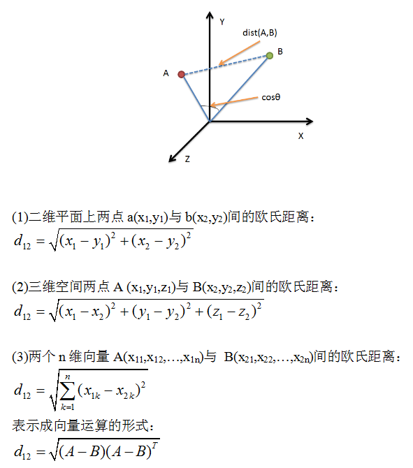
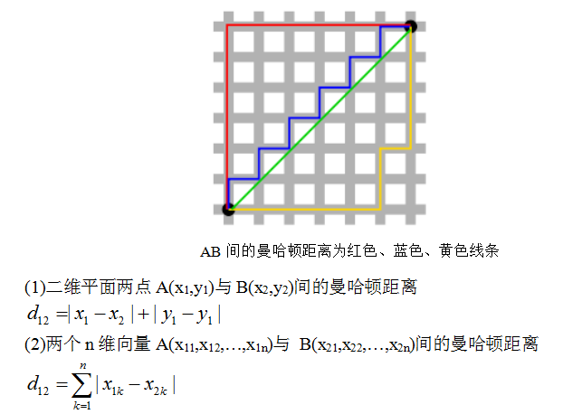
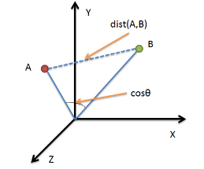

<!-- 
<span id="top"></span>
macdown下使用这条命令去生成toc
[toc] 
-->

* TOC
{:toc}

> 积累+学习

## 综述

所列的距离公式列表和代码如下：

* 闵可夫斯基距离(Minkowski Distance)
* **欧氏距离(Euclidean Distance)**
* **曼哈顿距离(Manhattan Distance)**
* 切比雪夫距离(Chebyshev Distance)
* **夹角余弦(Cosine)**
* 汉明距离(Hamming distance)
* **杰卡德相似系数(Jaccard similarity coefficient)**
* **皮尔逊相关系数(Pearson product-moment correlation coefficient)**

读者可根据自己需求有选择的学习。因使用矢量编程的方法，距离计算得到了较大的简化。

其中欧氏距离与曼哈顿距离是比较常用的

## 欧氏距离



python 源码 - 三种实现

```python
import numpy as np

vect1 = np.mat([1,2,3]);
vect2 = np.mat([2,3,4]);

dis = np.sqrt((vect1 - vect2) * (vect1 - vect2).T)

#sqrt(3)
print dis

dis = np.sqrt( np.sum( np.square(vect1 - vect2) ) )

print dis

dis = np.linalg.norm(vect1 - vect2)

print dis
```

## 曼哈顿距离(Manhattan Distance)



```python
import numpy as np

vect1 = np.mat([1,2,3])
vect2 = np.mat([2,3,4])

dis = np.sum( np.abs(vect1-vect2) )

#3
print dis
```

## 夹角余弦（Cosine）
几何中夹角余弦可用来衡量两个向量方向的差异，机器学习中借用这一概念来衡量样本向量之间的差异



在二维空间中向量A($x_1$,$y_1$)与向量B($x_2$,$y_2$)的夹角余弦公式：

$$
cos(\theta)=\frac{x_1x_2+y_1y_2}{\sqrt{x_1^2+y_1^2}\sqrt{x_2^2+y_2^2}}
$$

两个n维样本点A($x_{11}$,$x_{12}$,…,$x_{1n}$)与B($x_{21}$,$x_{22}$,…,$x_{2n}$)的夹角余弦类似的，对于两个**n**维样本点A($x_{11}$,$x_{12}$,…,$x_{1n}$)与B($x_{21}$,$x_{22}$,…,$x_{2n}$)，可以使用类似于夹角余弦的概念来衡量它们间的相似程度。

$$
cos(\theta)=\frac{AB}{|A||B|}
$$

即

$$
cos(\theta)=\frac{\sum_{k=1}^nx_{1k}x_{2k}}{\sqrt{\sum_{k=1}^nx_{1k}^2}\sqrt{\sum_{k=1}^nx_{2k}^2}}
$$

夹角余弦取值范围为[-1,1]。夹角余弦越大表示两个向量的夹角越小，夹角余弦越小表示两向量的夹角越大。当两个向量的方向重合时夹角余弦取最大值1，当两个向量的方向完全相反夹角余弦取最小值-1。

```python
import numpy as np

vect1 = np.random.rand(4).astype(float)
vect2 = np.random.rand(4).astype(float)

print vect1
print vect2

print np.dot(vect1,vect2)/( np.linalg.norm(vect1) * np.linalg.norm(vect2) )

#方法二：根据scipy库求解
from scipy.spatial.distance import pdist
X=np.vstack([x,y])
d2=1-pdist(X,'cosine')
```

## 杰卡德相似系数(Jaccard similarity coefficient)

### 杰卡德相似系数

两个集合A和B的交集元素在A，B的并集中所占的比例，称为两个集合的杰卡德相似系数，用符号J(A,B)表示。

$$
J(A,B) = \frac{|A \cap B|}{|A \cup B|}
$$

杰卡德相似系数是衡量两个集合的相似度一种指标。

### 杰卡德距离	

Jaccard距离用来度量两个集合之间的差异性，它是Jaccard的相似系数的补集，被定义为1减去Jaccard相似系数。

$$
J_{\delta}(A,B) = 1- J(A,B) = \frac{|A \cup B|-|A \cap B|}{|A \cup B|}
$$

python实现

```python
# coding=utf8

from __future__ import print_function

import numpy as np
from scipy.spatial.distance import pdist

x = np.random.random(10) > 0.5
y = np.random.random(10) > 0.5

x = np.asarray(x, np.int32)
y = np.asarray(y, np.int32)

# 方法一：根据公式求解
up = np.double(np.bitwise_and((x != y), np.bitwise_or(x != 0, y != 0)).sum())
down = np.double(np.bitwise_or(x != 0, y != 0).sum())
d1 = (up / down)

# 方法二：根据scipy库求解
X = np.vstack([x, y])
d2 = pdist(X, 'jaccard')
```

## 皮尔逊相关系数

> Pearson product-moment correlation coefficient，又称作 PPMCC或PCCs, 文章中常用r或Pearson's r表示。在统计学中，皮尔逊积矩相关系数（英语：Pearson product-moment correlation coefficient，又称作 PPMCC或PCCs, 文章中常用r或Pearson's r表示）用于度量两个变量X和Y之间的相关（线性相关），其值介于-1与1之间。在自然科学领域中，该系数广泛用于度量两个变量之间的相关程度。它是由卡尔·皮尔逊从弗朗西斯·高尔顿在19世纪80年代提出的一个相似却又稍有不同的想法演变而来的。这个相关系数也称作“皮尔森相关系数r”。

定义：

$$
cov(X,Y) = E[(x-\mu_x)(y-\mu_y)]=\frac{\sum_{i=1}^n(X_i-\overline X)(Y_i-\overline Y)}{n-1}
$$

Pearson相关系数公式如下：

$$
\rho(x,y) = corr(x,y)=\frac{cov(x,y)}{\sigma_x\sigma_y}=\frac{cov(x,y)}{\sqrt{D(x)}\sqrt{D(y)}}=cos(x- \overline x , y - \overline y )
$$

其实`皮尔逊系数`就是 **向量标准化后的余弦夹角距离**

标准化的意思是说, 对每个向量, 我先计算所有元素的平均值avg, 然后每个元素减去这个avg, 得到的这个向量叫做被标准化(也叫正规化)的向量. 基本上所有的机器学习, 数据挖掘用到向量的时候, 都要预处理做标准化.

我们观察皮尔逊系数的公式:

* 分子部分: 每个向量的每个数字要先减掉向量各个数字的平均值, 这就是在标准化.
* 分母部分: 两个根号式子就是在做取模运算, 里面的所有元素要减掉平均值, 其实也就是在做标准化.

```python
# coding=utf8

from __future__ import print_function

import numpy as np
x=np.random.random(10)
y=np.random.random(10)

#方法一：根据公式求解
x_=x-np.mean(x)
y_=y-np.mean(y)
d1=np.dot(x_,y_)/(np.linalg.norm(x_)*np.linalg.norm(y_))

#方法二：根据numpy库求解
X=np.vstack([x,y])
d2=np.corrcoef(X)[0][1]
```


## 引用

（1）[python 各类距离公式实现](http://blog.csdn.net/guojingjuan/article/details/50396254)
（2）[皮尔逊相关系数-知乎](https://www.zhihu.com/question/19734616?sort=created)
（3）[距离度量以及python实现](http://www.cnblogs.com/denny402/p/7028832.html)