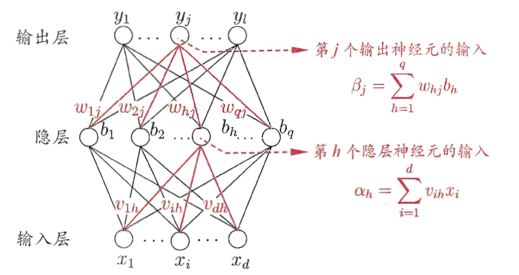
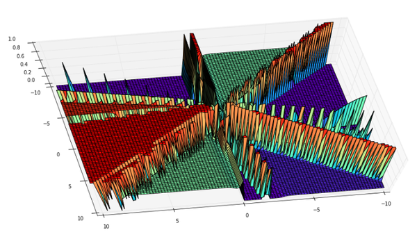

> 在机器学习和认知科学领域，人工神经网络（`artificial neural network`，缩写`ANN`），简称神经网络（`neural network`，缩写`NN`）或类神经网络，是一种模仿生物神经网络(动物的中枢神经系统，特别是大脑)的结构和功能的数学模型或计算模型，用于对函数进行`估计或近似`。神经网络由大量的人工神经元联结进行计算。

## 综述

大多数情况下人工神经网络能在外界信息的基础上改变内部结构，是一种自适应系统。现代神经网络是一种非线性统计性数据建模工具。典型的神经网络具有以下三个部分：
1. `结构 （Architecture）` 结构指定了网络中的变量和它们的拓扑关系。例如，神经网络中的变量可以是神经元连接的权重（`weights`）和神经元的激活值（`activities of the neurons`）。
2. `激活函数（Activity Rule）`大部分神经网络模型具有一个短时间尺度的动力学规则，来定义神经元如何根据其他神经元的活动来改变自己的激励值。一般激励函数依赖于网络中的权重（即该网络的参数）。
3. `学习规则（Learning Rule）`学习规则指定了网络中的权重如何随着时间推进而调整。这一般被看做是一种长时间尺度的动力学规则。一般情况下，学习规则依赖于神经元的激励值。它也可能依赖于监督者提供的目标值和当前权重的值。

## 初识神经网络

如上文所说，神经网络主要包括三个部分：`结构、激活函数、学习规则`。下图是一个三层的神经网络，输入层有`d`个节点，隐层有`q`个节点，输出层有`l`个节点。除了输入层，每一层的节点都包含一个非线性变换。



那么为什么要进行非线性变换呢？

（1）如果只进行线性变换，那么即使是多层的神经网络，依然只有一层的效果。类似于$0.6*(0.2\times1+0.3\times2)=0.12\times1+0.18\times2$。 
（2）进行**非线性变化**，可以使得神经网络可以拟合任意一个函数,下面是一个四层网络的图。 



下面使用数学公式描述每一个神经元工作的方式

（1）输入`x `
（2）计算`z=w*x`
（3）输出`new_x = f(z)`，这里的`f`是一个函数，可以是`sigmoid`、`tanh`、`relu`等，`f`就是上文所说到的激活函数。

## 反向传播(bp)算法

有了上面的`网络结构`和`激活函数`之后，这个网络是如何`学习参数（学习规则）`的呢？
首先我们先定义下本文使用的`激活函数`、`目标函数`

**sigmoid激活函数**

$$
f(x)=\frac1{1+e^{-x}}
$$

```python
def sigmoid(z):
    return 1.0/(1.0+np.exp(-z))
```

`sigmoid函数`有一个十分重要的性质：
$$
f(x)'=f(x)(1-f(x))
$$
，即计算导数十分方便。

```python
def sigmoid_prime(z):
    return sigmoid(z)*(1-sigmoid(z))
```

**目标函数（差的平方和）**

$$
E_k=\frac12\sum_{j=1}^l(y_{1k}^j-y_{2k}^j)^2
$$
公式中的$\frac12$是为了计算导数方便。

<font color="#f00">然后，这个网络是如何运作的</font>

(1）数据从输入层到输出层，经过各种非线性变换的过程即`前向传播`。

```python
def feedforward(self, a):
    for b, w in zip(self.biases, self.weights):
        a = sigmoid(np.dot(w, a)+b)
    return a
```
其中，初始的权重（w）和偏置（b）是随机赋值的

```
biases = [np.random.randn(y, 1) for y in sizes[1:]]
weights = [np.random.randn(y, x) for x, y in zip(sizes[:-1], sizes[1:])]
```

(2) 参数更新，即`反向传播`

## 反射传播流程：

反向传播算法（`Backpropagation`）是目前用来训练人工神经网络（Artificial Neural Network，ANN）的最常用且最有效的算法。其主要思想是：

（1）将训练集数据输入到ANN的输入层，经过隐藏层，最后达到输出层并输出结果，这是ANN的前向传播过程；

（2）由于ANN的输出结果与实际结果有误差，则计算估计值与实际值之间的误差，并将该误差从输出层向隐藏层反向传播，直至传播到输入层；

（3）在反向传播的过程中，根据误差调整各种参数的值；不断迭代上述过程，直至收敛。

具体的推导过程，请参数引用2

* 输入训练集

* 对于训练集中的每个样本$x$，设置输入层（Input layer）对应的激活值$a^l$：
前向传播：
$$
z^l = w^la^{l-1}+b^l,a^l=\sigma(z^l)
$$
其中$\sigma$指的是`激活函数`

* 计算输出层产生的错误：

$$
\delta^L = \nabla_\alpha C\odot \sigma'(z^l)
$$

其中$L$表示神经网络最大层数，`C`是代价函数，$\odot$表示`Hadamard`乘积，用于矩阵或向量之间点对点的乘法运算。

> `代价函数`被用来计算`ANN`输出值与实际值之间的误差。常用的代价函数是二次代价函数（Quadratic cost function）：
> $$C = \frac1{2}\sum_x||y(x)-\alpha^L(x)||^2$$
> 其中，$x$表示输入的样本，$y$表示实际的分类，$\alpha^L$表示预测的输出，$L$表示神经网络的最大层数

* 反向传播错误：

$$
\delta^l = ((w^{l+1})^T\delta^{l+1}) \odot \sigma'(z^l)
$$

* 使用梯度下降（`gradient descent`），训练参数：

$$
w^l = w^l - \frac{\eta}m\sum_x\delta^{x,l}(\alpha^{x,l-1})^T
$$

$$
b^l = b^l - \frac{\eta}m\sum_x\delta^{x,l}
$$

## python示例

```python
# -*- coding: utf-8 -*-

import random
import numpy as np

class Network(object):

    def __init__(self, sizes):
    """参数sizes表示每一层神经元的个数，如[2,3,1],表示第一层有2个神经元，第二层有3个神经元，第三层有1个神经元."""
        self.num_layers = len(sizes)
        self.sizes = sizes
        self.biases = [np.random.randn(y, 1) for y in sizes[1:]]
        self.weights = [np.random.randn(y, x)
                        for x, y in zip(sizes[:-1], sizes[1:])]

    def feedforward(self, a):
        """前向传播"""
        for b, w in zip(self.biases, self.weights):
            a = sigmoid(np.dot(w, a)+b)
        return a

    def SGD(self, training_data, epochs, mini_batch_size, eta,
            test_data=None):
        """随机梯度下降"""
        if test_data: 
            n_test = len(test_data)
        n = len(training_data)
        for j in xrange(epochs):
            random.shuffle(training_data)
            mini_batches = [
                training_data[k:k+mini_batch_size]
                for k in xrange(0, n, mini_batch_size)]
            for mini_batch in mini_batches:
                self.update_mini_batch(mini_batch, eta)
            if test_data:
                print "Epoch {0}: {1} / {2}".format(j, self.evaluate(test_data), n_test)
            else:
                print "Epoch {0} complete".format(j)

    def update_mini_batch(self, mini_batch, eta):
        """使用后向传播算法进行参数更新.mini_batch是一个元组(x, y)的列表、eta是学习速率"""
        nabla_b = [np.zeros(b.shape) for b in self.biases]
        nabla_w = [np.zeros(w.shape) for w in self.weights]
        for x, y in mini_batch:
            delta_nabla_b, delta_nabla_w = self.backprop(x, y)
            nabla_b = [nb+dnb for nb, dnb in zip(nabla_b, delta_nabla_b)]
            nabla_w = [nw+dnw for nw, dnw in zip(nabla_w, delta_nabla_w)]
        self.weights = [w-(eta/len(mini_batch))*nw
                        for w, nw in zip(self.weights, nabla_w)]
        self.biases = [b-(eta/len(mini_batch))*nb
                       for b, nb in zip(self.biases, nabla_b)]

    def backprop(self, x, y):
        """返回一个元组(nabla_b, nabla_w)代表目标函数的梯度."""
        nabla_b = [np.zeros(b.shape) for b in self.biases]
        nabla_w = [np.zeros(w.shape) for w in self.weights]
        # 前向传播
        activation = x
        activations = [x] # list to store all the activations, layer by layer
        zs = [] # list to store all the z vectors, layer by layer
        for b, w in zip(self.biases, self.weights):
            z = np.dot(w, activation)+b
            zs.append(z)
            activation = sigmoid(z)
            activations.append(activation)
        # backward pass
        delta = self.cost_derivative(activations[-1], y) * sigmoid_prime(zs[-1])
        nabla_b[-1] = delta
        nabla_w[-1] = np.dot(delta, activations[-2].transpose())
        """l = 1 表示最后一层神经元，l = 2 是倒数第二层神经元, 依此类推."""
        for l in xrange(2, self.num_layers):
            z = zs[-l]
            sp = sigmoid_prime(z)
            delta = np.dot(self.weights[-l+1].transpose(), delta) * sp
            nabla_b[-l] = delta
            nabla_w[-l] = np.dot(delta, activations[-l-1].transpose())
        return (nabla_b, nabla_w)

    def evaluate(self, test_data):
        """返回分类正确的个数"""
        test_results = [(np.argmax(self.feedforward(x)), y) for (x, y) in test_data]
        return sum(int(x == y) for (x, y) in test_results)

    def cost_derivative(self, output_activations, y):
        return (output_activations-y)

def sigmoid(z):
    return 1.0/(1.0+np.exp(-z))

def sigmoid_prime(z):
    """sigmoid函数的导数"""
    return sigmoid(z)*(1-sigmoid(z))
```

## 简单应用

```
# -*- coding: utf-8 -*-

from network import *

def vectorized_result(j,nclass):
    """离散数据进行one-hot"""
    e = np.zeros((nclass, 1))
    e[j] = 1.0
    return e

def get_format_data(X,y,isTest):
    ndim = X.shape[1]
    nclass = len(np.unique(y))
    inputs = [np.reshape(x, (ndim, 1)) for x in X]
    if not isTest:
        results = [vectorized_result(y,nclass) for y in y]
    else:
        results = y
    data = zip(inputs, results)
    return data

#随机生成数据
from sklearn.datasets import *
np.random.seed(0)
X, y = make_moons(200, noise=0.20)
ndim = X.shape[1]
nclass = len(np.unique(y))

#划分训练、测试集
from sklearn.model_selection import train_test_split
train_x,test_x,train_y,test_y = train_test_split(X,y,test_size=0.2,random_state=0)

training_data = get_format_data(train_x,train_y,False)
test_data = get_format_data(test_x,test_y,True)

net = Network(sizes=[ndim,10,nclass])
net.SGD(training_data=training_data,epochs=5,mini_batch_size=10,eta=0.1,test_data=test_data)
```

## 引用

1. [http://blog.csdn.net/a819825294/article/details/53393837](http://blog.csdn.net/a819825294/article/details/53393837)
2. [反向传播推导](http://blog.csdn.net/u014313009/article/details/51039334)
