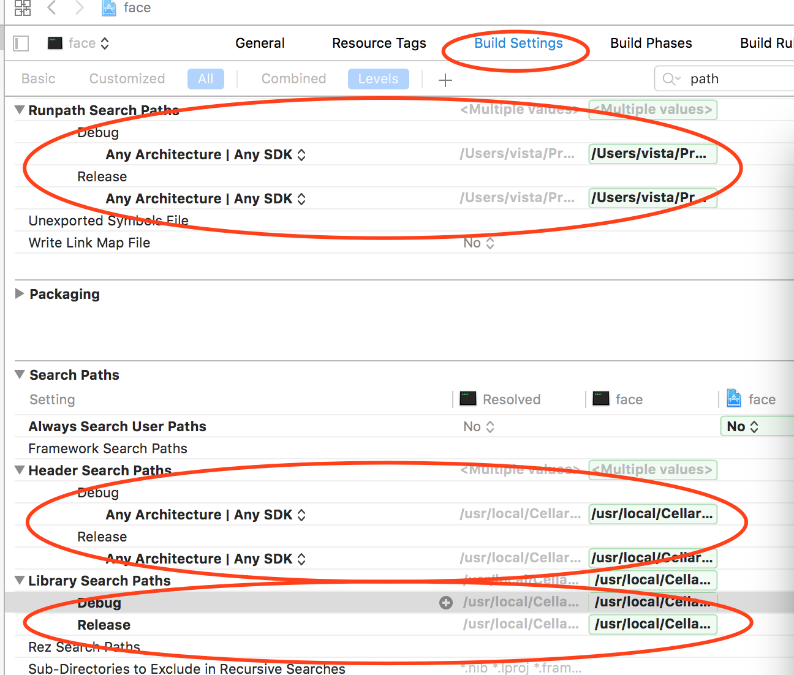
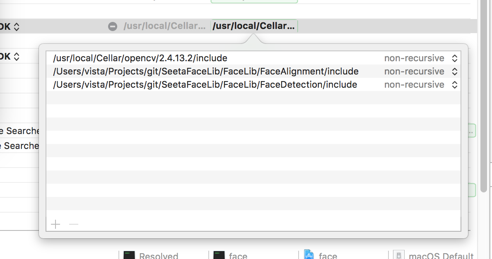

> window端有vistual studio , mac有xcode

## 综述

Xcode 是运行在操作系统Mac OS X上的集成开发工具（IDE），由苹果公司开发。Xcode是开发OS X 和 iOS 应用程序的最快捷的方式。Xcode 具有统一的用户界面设计，编码、测试、调试都在一个简单的窗口内完成。

## 快捷键

> 没试过，摘自baidu百科

```
- 文件

CMD + N: 新文件； CMD + SHIFT + N: 新项目； CMD + O: 打开；
CMD + S: 保存； CMD + SHIFT + S: 另存为；
CMD + W: 关闭窗口； CMD + SHIFT + W: 关闭文件

- 编辑

CMD + [: 左缩进；CMD + ]: 右缩进；
CMD + CTRL + LEFT: 折叠；CMD + CTRL + RIGHT: 取消折叠；
CMD + CTRL + TOP: 折叠全部函数；CMD + CTRL + BOTTOM: 取消全部函数折叠；
CTRL + U: 取消全部折叠；
CMD + D: 添加书签； CMD + /: 注释或取消注释；
CTRL + .: 参数提示； ESC: 自动提示列表

- 调试

CMD + \: 设置或取消断点；
CMD + OPT + \: 允许或禁用当前断点；
CMD + OPT + B: 查看全部断点；
CMD + RETURN: 编译并运行（根据设置决定是否启用断点）；
CMD + R: 编译并运行（不触发断点）；
CMD + Y: 编译并调试（触发断点）；
CMD + SHIFT + RETURN: 终止运行或调试；
CMD + B: 编译；
CMD + SHIFT + K: 清理；
```

## 创建普通项目

打开XCode之后，我们开始创建我们的第一个控制台程序“HelloWorld”了，顺便熟悉一下XCode的界面及使用。

首先选择“Create a New Xcode project”，然后选择“Open”按钮；

左侧选择“Mac OS X”下面的“Application”，然后在右侧选择“Command Line Tool”（这表示我们要创建Mac操作系统下面的一个控制台应用程序），然后选择右下角的“Next”按钮；

输入项目名称、公司名称，然后选择“Next”按钮；

然后选择项目要保存的文件路径（只需选择项目存放在哪个文件夹，项目自身的文件夹会自行创建，不用再另行输入），然后选择“Create”按钮；

## 配置

因为刚接触xcode配置，摸索了几个小时的时间，因为本来我是在别人的项目基础来做的，发现一团乱，因此自己创建了一个，从头配置。

项目包含opencv，及自定义的一些类库，

因为之前有过c++经验，以linux上开发的经验，所以我们知道，如果要引用外部的一些类库，主要需要包含头文件及lib库

在xcode中配置如下，点击左侧项目，出现的项目属性中：



如上图所示，我们需要配置的模块有`Header Search Paths`，`Library Search Paths`，**`Runpath Search Paths`**(这里取决于我们在mac os下生成的lib中含有`@rpath`)

> `@rpath`这个就是今天要介绍的重点，它是run path的缩写。本质上它不是一个明确的path，甚至可以说它不是一个path。它只是一个变量，或者叫占位符。这个变量通过上图位置进行设置。设置好run path之后，所有的@rpath都会被替换掉。此外，run path是可以设置多个值的，这样看来就和Windows下的PATH变量差不多了。run path指定的多个值就可可以完美解决掉参考链接中说的问题了。

在配置的时候将相应的路径添加进去即可，需要注意的是，双击路径以添加多条：


