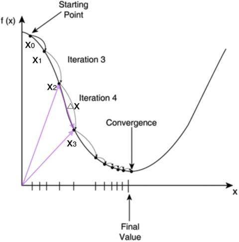

> 随机梯度下降算法(Stochastic Gradient Descent, SGD)

## 引

大学时我们学过怎样求函数的极值。函数$y=f(x)$的极值点，$f'(x)=0$就是它的导数的那个点。因此我们可以通过解方程$f'(x)=0$，求得函数的极值点$(x_0,y_0)$。

不过对于计算机来说，它可不会解方程。但是它可以凭借强大的计算能力，一步一步的去把函数的极值点『试』出来。如下图所示：

首先，我们随便选择一个点开始，比如上图的$x_0$点。接下来，每次迭代修改$x$值为$x_1,x_2,…$，经过数次迭代后最终达到函数最小值点。

你可能要问了，为啥每次修改$x$的值，都能往函数最小值那个方向前进呢？这里的奥秘在于，我们每次都是向函数$y=f(x)$的`梯度的相反方向`来修改$x$。什么是`梯度`呢？翻开大学高数课的课本，我们会发现梯度是一个向量，它指向函数值上升最快的方向。显然，梯度的反方向当然就是函数值下降最快的方向了。我们每次沿着梯度相反方向去修改的值，当然就能走到函数的最小值附近。之所以是最小值附近而不是最小值那个点，是因为我们每次移动的步长不会那么恰到好处，有可能最后一次迭代走远了越过了最小值那个点。步长的选择是门手艺，如果选择小了，那么就会迭代很多轮才能走到最小值附近；如果选择大了，那可能就会越过最小值很远，收敛不到一个好的点上。

按照上面的讨论，我们就可以写出梯度下降算法的公式

$$
x_{new} = x_{old} - \eta\nabla f(x)
$$
其中，$\nabla$是*梯度算子*，$\nabla f(x)$就是指$f(x)$的*梯度*。$\eta$是步长，也称作*学习速率*。

****省略部分****

推导出权值修改的梯度下降公式

$$
W_{new} = W_{old} + \eta\sum_{i=1}^n(y^{(i)} - \bar{y}^{(i)})X^{(i)} 
$$

需要说明的是，如果每个样本有M个特征，则上式中的$X,W$都是`M+1维`向量(因为我们加上了一个恒为1的虚拟特征$x_0$，参考前面的内容，而是$y$标量。用高逼格的数学符号表示，就是
$$
X,W \in\Re^(M+1)
$$
$$
y\in\Re^1
$$

## 随机梯度下降算法(Stochastic Gradient Descent, SGD)

如果我们根据上面推导出的公式来训练模型，那么我们每次更新`W`的迭代，要遍历训练数据中所有的样本进行计算，我们称这种算法叫做批梯度下降(**Batch Gradient Descent**)。如果我们的样本非常大，比如数百万到数亿，那么计算量异常巨大。因此，实用的算法是`SGD`算法。在`SGD`算法中，每次更新的迭代，只计算一个样本。这样对于一个具有数百万样本的训练数据，完成一次遍历就会对`W`更新数百万次，效率大大提升。由于样本的噪音和随机性，每次更新并不一定按照减少的方向。然而，虽然存在一定随机性，大量的更新总体上沿着减少`E`的方向前进的，因此最后也能收敛到最小值附近。
最后需要说明的是，SGD不仅仅效率高，而且随机性有时候反而是好事。今天的目标函数是一个『凸函数』，沿着梯度反方向就能找到全局唯一的最小值。然而对于非凸函数来说，存在许多局部最小值。随机性有助于我们逃离某些很糟糕的局部最小值，从而获得一个更好的模型。

## 引用

1. https://www.zybuluo.com/hanbingtao/note/448086