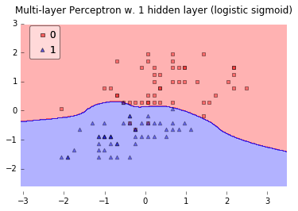

> The Activation Function in Deep Learning

## 作用

`激活函数`不是真的要去激活什么。在神经网络中，激活函数的作用是能够给神经网络加入一些**非线性因素**，使得神经网络可以更好地解决较为复杂的问题。在神经网络中，我们需要引入一些非线性的因素，来更好地解决复杂的问题。而激活函数恰好就是那个能够帮助我们引入非线性因素的存在。

<!--

-->

## 定义及其相关概念

在ICML2016的一篇论文[Noisy Activation Functions](https://arxiv.org/pdf/1603.00391v3.pdf)中，作者将激活函数定义为一个几乎处处可微的$ h : R → R $。


在实际应用中，我们还会涉及到以下的一些概念：

a.饱和

当一个激活函数$h(x)$满足

$lim_{n\to+\infty}h′(x)=0$

$lim_{n\to+\infty}h′(x)=0$

时我们称之为`右饱和`。

当一个激活函数$h(x)$满足

$lim_{n\to-\infty}h′(x)=0$

$lim_{n\to-\infty}h′(x)=0$

时我们称之为`左饱和`。当一个激活函数，既满足左饱和又满足又饱和时，我们称之为`饱和`。

b.硬饱和与软饱和

对任意的$x$，如果存在常数$cc$，当$x>c$时恒有$h′(x)=0$则称其为`右硬饱和`，当$x<c$时恒 有$h′(x)=0$则称其为`左硬饱和`。若既满足左硬饱和，又满足右硬饱和，则称这种激活函数为`硬饱和`。但如果只有在极限状态下偏导数等于0的函数，称之为`软饱和`。

## 常用线性激活

$$ f(x)=kx+c\qquad \qquad \text{线性函数} $$

$$
f(x)= { \left \{ { \begin{array}{rcl} T,x>c \\ k*x, |x| \leqslant c   \\ -T, x < -c \end{array} } \right. } \qquad \qquad  \text{斜面函数}
$$

$$
f(x) = \left\{ \begin{array}{rcl} 1,x>c \\ 0,x \leqslant c \end{array} \right.\qquad  \qquad \text{阈值函数}
$$

## $softmax$回归函数

这里需要介绍一下，因为在tensorflow的mnist分类中使用的示例激活函数就是采用了这个
公式：
$$
softmax(x) = normalize(e^x)
$$

展开上式

$$
softmax(x)_i = \frac{e^{x_i}}{\sum_je^{x_j}}
$$

计算损失公式`“交叉熵”（cross-entropy）`：

$$
H_{y'}(y) = - \sum_i y'_i log(y_i)
$$

$y$是我们预测的概率分布, $y'$是实际的分布。比较粗糙的理解是，交叉熵是用来衡量我们的预测用于描述真相的低效性。


## $sigmoid$函数

Sigmoid函数曾被广泛地应用，但由于其自身的一些缺陷，现在很少被使用了。
定义：
$$
f(x) = \frac 1 {1+e^{-x}}
$$

图示：


导数	

$$f'(x)=f(x)(1-f(x))$$

优点：
1.Sigmoid函数的输出映射在(0,1)之间，单调连续，输出范围有限，优化稳定，可以用作输出层。
2.求导容易。

缺点：
1.由于其软饱和性，容易产生梯度消失，导致训练出现问题。
2.其输出并不是以0为中心的。

## $tanh$函数
现在，比起Sigmoid函数我们通常更倾向于tanh函数。tanh函数被定义为
$$
tanh(x) = \frac{e^x-e^{-x}}{e^x+e^{-x}}
$$
导数：
$$
f(x) = 1 - (f(x))^2
$$
函数位于[-1, 1]区间上，对应的图像是:


优点：
1.比Sigmoid函数收敛速度更快。
2.相比Sigmoid函数，其输出以0为中心。
缺点：
还是没有改变Sigmoid函数的最大问题——由于饱和性产生的梯度消失。

## $Relu$(Rectified Linear Units)函数

最近几年卷积神经网络中，激活函数往往不选择sigmoid或tanh函数，而是选择relu函数。Relu函数的定义是：
$$
f(x) = max(0,x)
$$
Relu函数图像如下图所示：


`Relu函数`作为激活函数，有下面几大`优势`：

- **速度快** 和sigmoid函数需要计算指数和倒数相比，relu函数其实就是一个$max(0,x)$，计算代价小很多。

- **减轻梯度消失问题** 回忆一下计算梯度的公式$\nabla=\sigma'\delta x$。其中，$\sigma'$是sigmoid函数的导数。在使用反向传播算法进行梯度计算时，每经过一层sigmoid神经元，梯度就要乘上一个$\sigma'$。从下图可以看出，$\sigma'$函数最大值是1/4。因此，乘一个$\sigma'$会导致梯度越来越小，这对于深层网络的训练是个很大的问题。而relu函数的导数是1，不会导致梯度变小。当然，激活函数仅仅是导致梯度减小的一个因素，但无论如何在这方面relu的表现强于sigmoid。使用relu激活函数可以让你训练更深的网络。


- **稀疏性** 通过对大脑的研究发现，大脑在工作的时候只有大约5%的神经元是激活的，而采用sigmoid激活函数的人工神经网络，其激活率大约是50%。有论文声称人工神经网络在15%-30%的激活率时是比较理想的。因为relu函数在输入小于0时是完全不激活的，因此可以获得一个更低的激活率。

- 在没有无监督预训练的时候也能有较好的表现

缺点：
随着训练的进行，可能会出现神经元死亡，权重无法更新的情况。如果发生这种情况，那么流经神经元的梯度从这一点开始将永远是0。也就是说，ReLU神经元在训练中不可逆地死亡了。

## Self-Normalizing Neural Networks【`SNN`】

```python
def selu(x):
    with tf.name_scope('selu') as scope:
        alpha = 1.6732632423543772848170429916717
        scale = 1.0507009873554804934193349852946
        return scale * tf.where(x>=0.0,x,alpha*tf.nn.elu(x))
```


# 引用

1. 【[CSDN 神经网络中的激活函数](http://blog.csdn.net/losteng/article/details/50833861)】
2. 【[cnblogs 浅谈深度学习中的激活函数 - The Activation Function in Deep Learning](http://www.cnblogs.com/rgvb178/p/6055213.html)】
3. 【[Self-Normalizing Neural Networks](https://arxiv.org/abs/1706.02515)】