> 遇到问题，先用已知的知识和成果，给出最好的方案。再去进一步探索现有方案的优点与不足，了解算法的本质。进而朝着你期望的方案不断去探索新的好的方案而努力

<span id="top"></span>

## 目录

* [问题](#1) 
* [框架](#2) 
* [CEDD](#3)
* [探索其他的方法](#4)
* [色彩算法](#5)
* [SIFT](#6)
* [SIFT算法调整](#7)
* [最终流程](#8)

<h2 id="1">问题</h2>

|项目|详述|
|:--:|:--:|
|图库大小|30W->100W+，目前70W|
|目标|通过拍照的图片进行检索，根据相似度列出搜索结果|

<h2 id="2">框架</h2>

[LIRE: Lucene Image Retrieval](#lire)
> LIRE is a Java library that provides a simple way to retrieve images and photos based on color and texture characteristics. LIRE creates a Lucene index of image features for content based image retrieval (`CBIR`) using local and global state-of-the-art methods. Easy to use methods for searching the index and result browsing are provided. Best of all: it's all open source.

<h2 id="3">CEDD全局算子</h2>

> 在1.0版本APP中，主要使用的算子就是CEDD算子，其原理与效果如下

[图像检索：CEDD（Color and Edge Directivity Descriptor）算法](http://blog.csdn.net/leixiaohua1020/article/details/16883379)

`CEDD`的英文全称是Color and Edge Directivity Descriptor，即颜色和边缘方向特征描述符。它结合了图像的颜色和纹理信息，生成一个(`24*6`)位的直方图。这个特征提取方法可以分为两个子模块系统，提取颜色信息的是颜色模块，提取纹理信息的是纹理模块。CEDD直方图信息由六个区域组成，也就是纹理模块，六个区域就是提取出的6维向量直方图，然后在这些纹理信息的每一维中再加入颜色模块提取出的24维颜色信息，这样就可以将颜色和纹理有效结合起来，最终得出**6*24=144**维的直方图信息。

直方图中各维信息的含义分别是：（0）无边缘信息，（1）无方向的边缘信息，（2）水平方向的边缘信息，（3）垂直方向的边缘信息，（4） 45度方向的边缘信息，（5） 135度方向的边缘信息。

10-bins直方图信息值的含义如下：（0）黒色（Black），（1）灰色（Gray），（2）白色（White），（3）红色（Red）, （4）橙色（Orange），（5）黄色（Yellow），（6）绿色（Green），（7）青色（Cyan），（8）蓝色（Blue），（9）品红色（Magenta）。

24-bins模糊过滤器就是将10-bins模糊过滤器输出的每种色区再分为3个H值区域，输入一个10维向量和S、V通道值，输出的是一个24维向量。它输出的每一维所代表的信息分别是：（0）黑色（Black），（1）灰色（Grey），（2）白色（White），（3）暗红色（Dark Red），（4）红色（Red），（5）浅红（Light Red）,（6）暗橙色（DarkOrange），（7）橙色（Orange），（8）浅橙色（Light Orange），（9）暗黄色（Dark Yellow），（10）黄色（Yellow）, （11）浅黄色（LightYellow），（12）深绿色（Dark Green），（13）绿色（Green），（14）浅绿色（Light Green），（15）暗青色（Dark Cyan），（16）青色（Cyan），（17）浅青色（Light Cyan），（18）深蓝色（Dark Blue）,（19）蓝色（Blue），（20）淡蓝色（LightBlue），（21）暗品红色（DarkMagenta），（22）品红色（Magenta），（23）浅品红色（Light Magenta）。


> 搜索效果：


> 结论：
> 色彩效果很不错，但是结构纹理不能保证，聚类效果差

<h2 id="4">探索其他的方法</h2>

[已有其他的一些较好算子](http://192.168.21.10/docs/show/432)

<h2 id="5">色彩算法</h2>

[图像主色调](http://192.168.21.10/docs/show/660)

<h2 id="6">SIFT局部算子</h2>

SIFT（Scale-invariant feature transform）是一种检测局部特征的算法，该算法通过求一幅图中的特征点（interest points,or corner points）及其有关scale 和 orientation 的描述子得到特征并进行图像特征点匹配，获得了良好效果，详细解析如下：

> 算法描述 

SIFT特征不只具有尺度不变性，即使改变旋转角度，图像亮度或拍摄视角，仍然能够得到好的检测效果。整个算法分为以下几个部分： 

1. 构造尺度空间：DoG尺度空间 
1. 检测DoG尺度空间极值点 
1. 去除不好的特征点 
1. 给特征点赋值一个128维的方向参数。每个关键点都包含三个信息：位置、尺度和方向。 
1. 关键点描述子的生成
 
具体可以去这篇博文看一下：
[图像特征— —SIFT特征](http://blog.csdn.net/sin_geek/article/details/52661670) 

SIFT算法的特点：

* SIFT特征是图像的局部特征，其对旋转、尺度缩放、亮度变化保持不变性，对视角变化、仿射变换、噪声也保持一定程度的稳定性；

* 独特性（Distinctiveness）好，信息量丰富，适用于在海量特征数据库中进行快速、准确的匹配；

* 多量性，即使少数的几个物体也可以产生大量的SIFT特征向量；

* 高速性，经优化的SIFT匹配算法甚至可以达到实时的要求；

* 可扩展性，可以很方便的与其他形式的特征向量进行联合。

SIFT算法可以解决的问题：

目标的自身状态、场景所处的环境和成像器材的成像特性等因素影响图像配准/目标识别跟踪的性能。而SIFT算法在一定程度上可解决：

* 目标的旋转、缩放、平移（RST）

* 图像仿射/投影变换（视点viewpoint）

* 光照影响（illumination）

* 目标遮挡（occlusion）

* 杂物场景（clutter）

* 噪声

SIFT算法的实质是在不同的尺度空间上查找关键点(特征点)，并计算出关键点的方向。SIFT所查找到的关键点是一些十分突出，不会因光照，仿射变换和噪音等因素而变化的点，如角点、边缘点、暗区的亮点及亮区的暗点等。

SIFT在图像的不变特征提取方面拥有无与伦比的优势，但并不完美，仍然存在：

* 相对来说实时性还不够高。

* 有时特征点较少。

* **对边缘光滑的目标无法准确提取特征点**。

等缺点，如下图所示，对模糊的图像和边缘平滑的图像，检测出的特征点过少。

<h2 id="7">SIFT算法调整</h2>

### 图片size

[图片大小对SIFT特征提取的影响](http://192.168.21.10/docs/show/509)

### sift算法应用

[单纯用sift进行匹配](http://192.168.21.10/docs/show/662)

[`BOW`介绍](../blog/CBIR-BoW-for-image-retrieval-and-practice.html)

### 效果

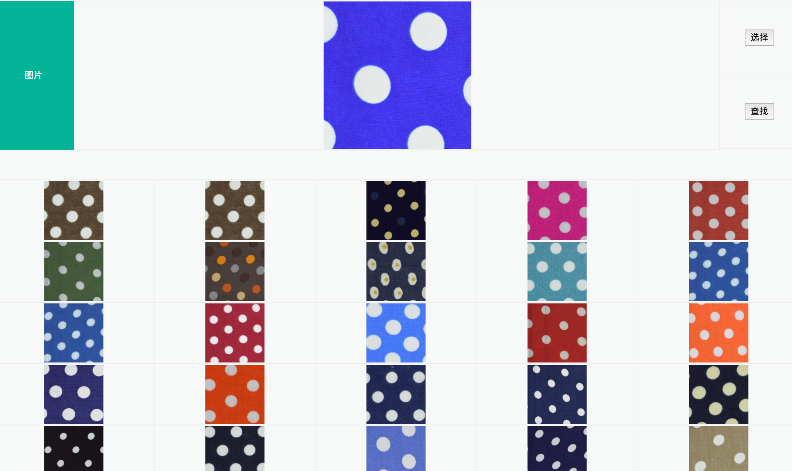

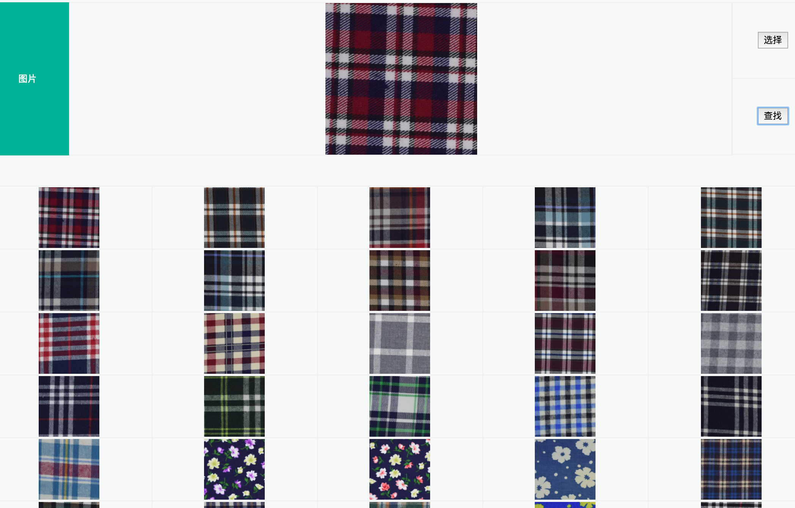


### 但是面临真实的拍照环境，结果却没有那么理想

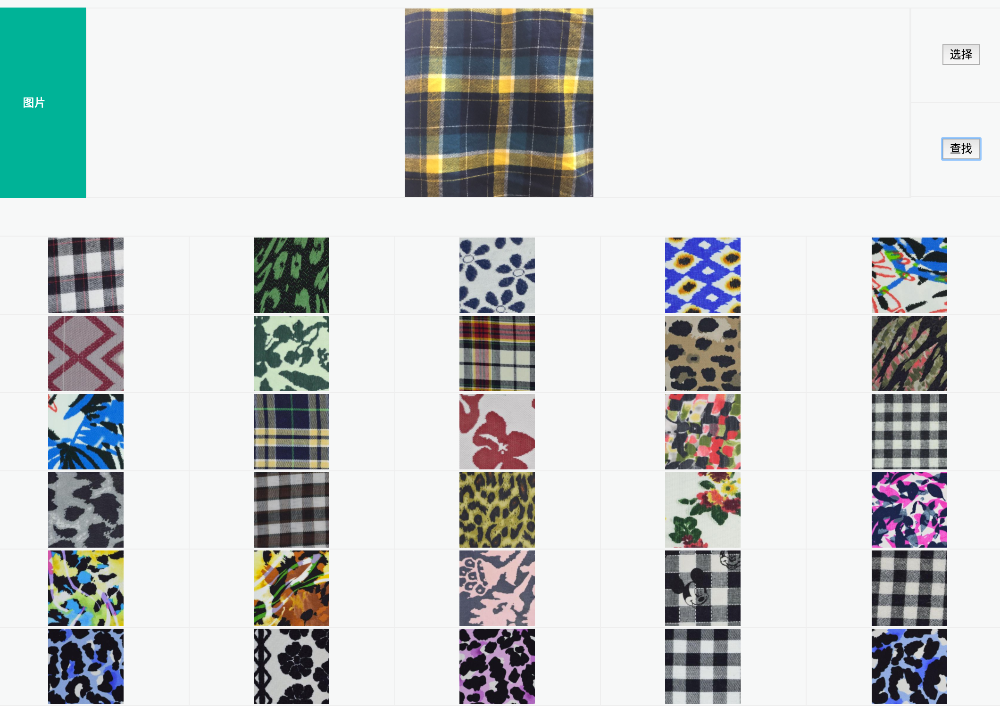

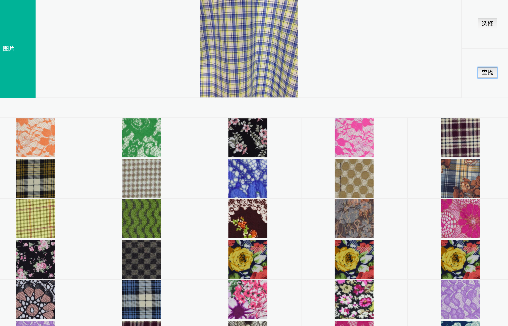

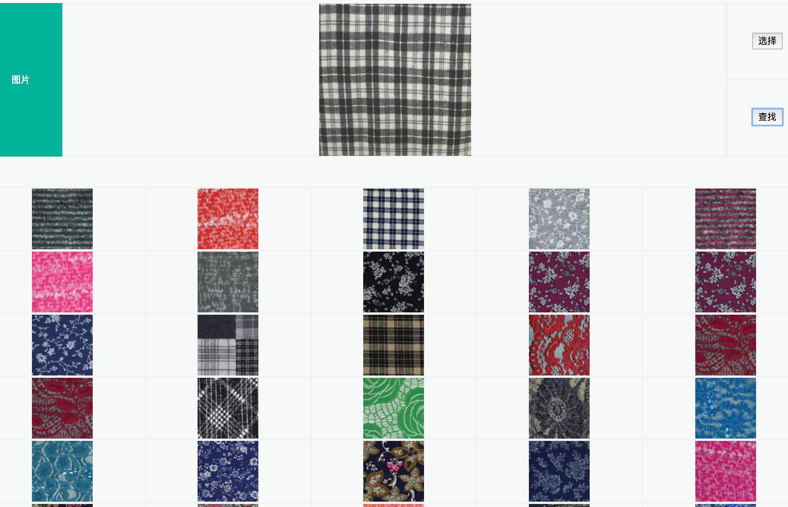

### 改进BOW的SIZE

> 由512->1024
并重建码表

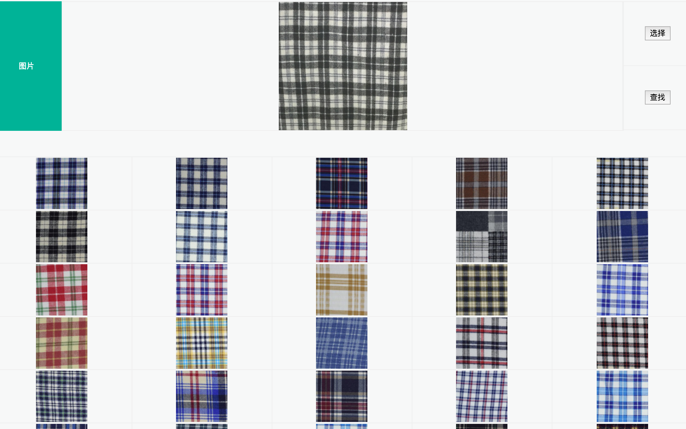

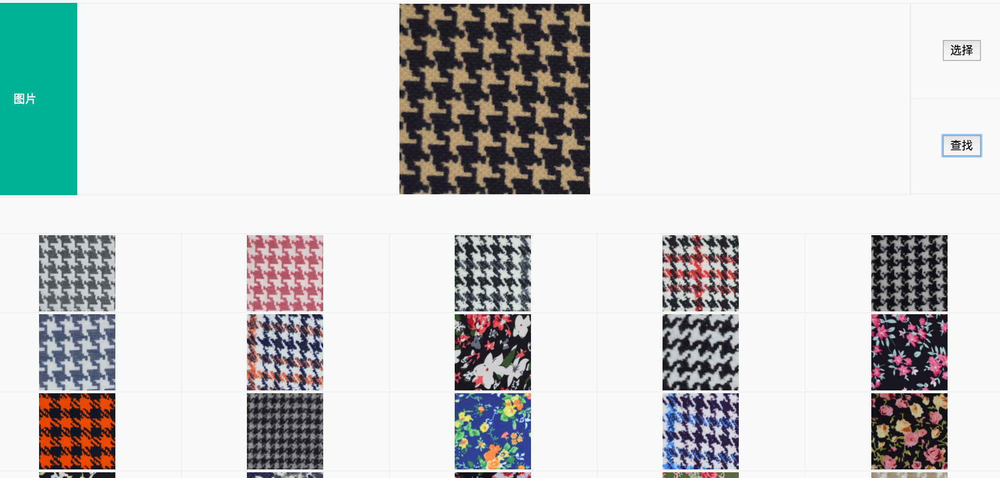

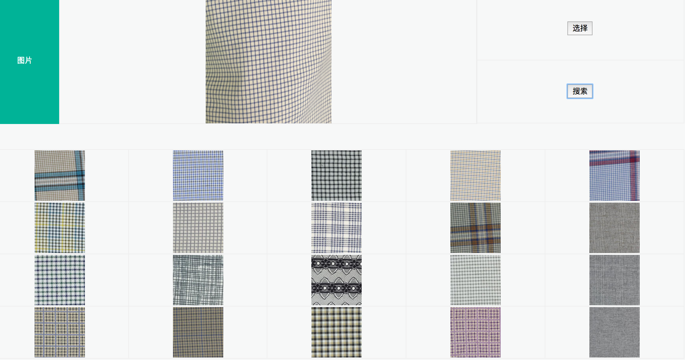

### 改进条纹

```cpp
SIFT::SIFT(int nfeatures=0, int nOctaveLayers=3, double contrastThreshold=0.04, double edgeThreshold=  
10, double sigma=1.6)
```

在sift算法中有几个参数：

    nfeatures：特征点数目（算法对检测出的特征点排名，返回最好的nfeatures个特征点）。
    nOctaveLayers：金字塔中每组的层数（算法中会自己计算这个值，后面会介绍）。
    contrastThreshold：过滤掉较差的特征点的对阈值。contrastThreshold越大，返回的特征点越少。
    edgeThreshold：过滤掉边缘效应的阈值。edgeThreshold越大，特征点越多（被多滤掉的越少）。
    sigma：金字塔第0层图像高斯滤波系数，也就是σ。
	

edgeThreshold调整

> 采用默认值-10

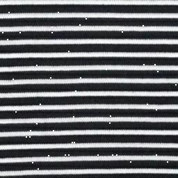

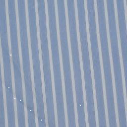

> 50

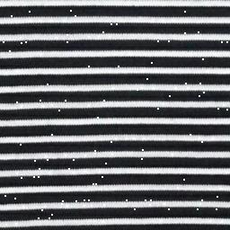

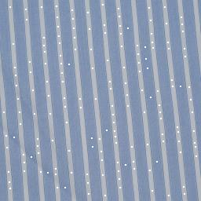

> 200

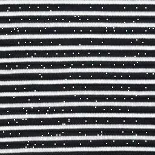

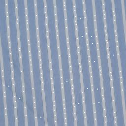


1024+50（edge）


1024+200（edge）


### 最终效果展示


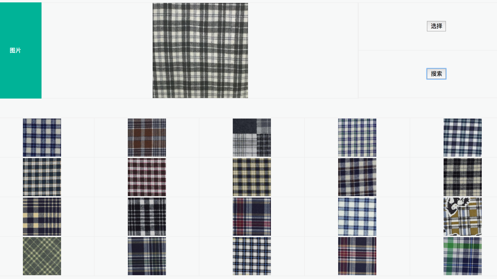

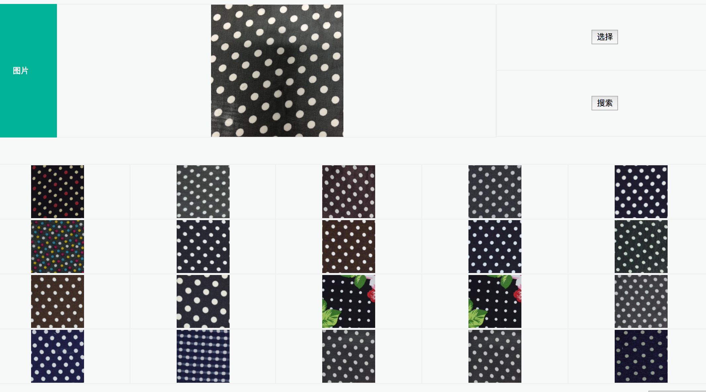

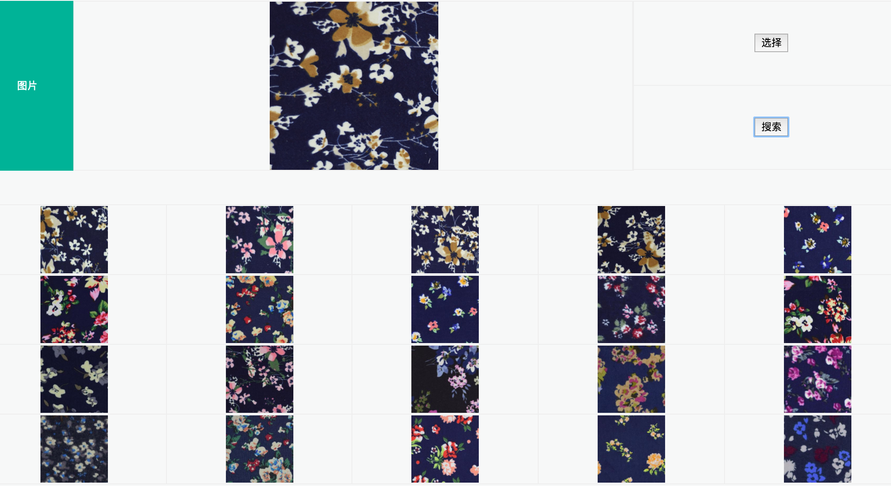

> 纯色效果


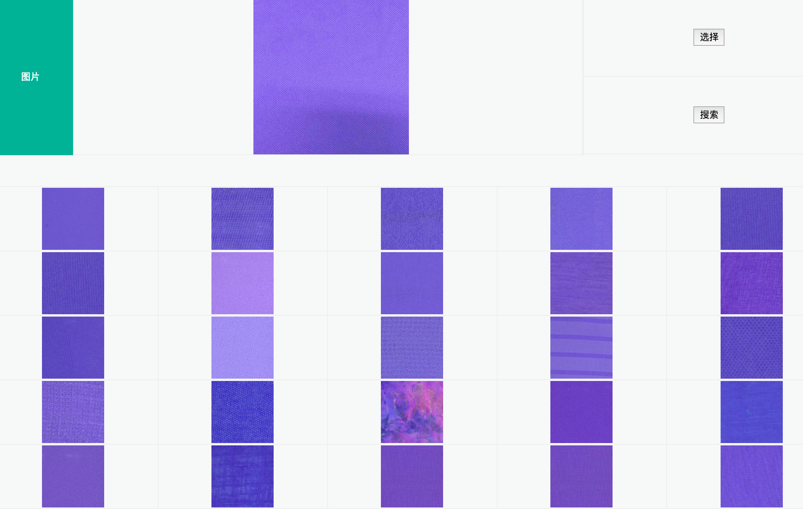

<h2 id="8">最终流程</h2>


## 引用

1. 【<span id="lire">[**LIRe**](http://www.lire-project.net/),[**github**](https://github.com/dermotte/lire)</span>】
2. 【[图像检索：CEDD（Color and Edge Directivity Descriptor）算法](http://blog.csdn.net/leixiaohua1020/article/details/16883379)】

## 附

[回到目录](#top)