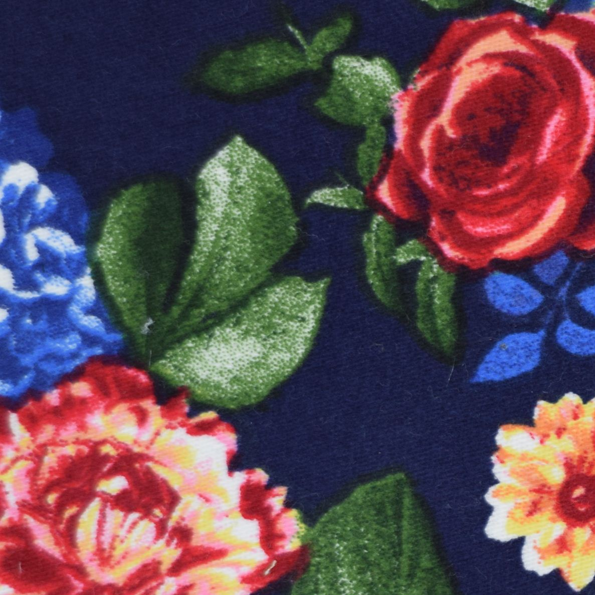

> 

<h2 id="3">算法改进</h2>

在新的APP版本中，我们对图像搜索的改进分为色彩和结构纹理两个方面：
在1.0版本中，我们采用的是建立二十四维色彩空间与全局纹理相结合的算法，已经取得了不小的成果，但是鉴于搜索结果上存在色彩精准度有细微差别，结构纹理的吻合度不够，细节抓的不够清晰的缺点。故我司在2.2版本中改进了搜索的技术。具体如下：在色彩空间上，我们将图像所有的像素的提取出来进行聚合，计算出主色调成分，更加准确的表述出布料的色彩空间，这样我们再描述多色彩的面料时就不会困惑布料的色彩组成了。并结合新的主色调对比算法，取得了不错的效果。

在结构纹理空间上，采取的改进是针对图像特征的提取算法的改进，以前我们使用的方式是切割图像与方向特征的描述，是一种全局图像特征的表述，缺点就是不能准确的保留图像的细微边缘与角点的特征信息，丢失了大量图像信息的算法自然无法达到更好的搜索体验。而新版本的APP中，我们提取的面料图像的角点与边缘信息，并对信息进行打包，提出一种改进的尺度不变特征变换匹配算法，使之更加契合我们的面料图像的特征表述，并且更符合实时性要求。因为这样更加『原汁原味』的提炼算法，使得我们的在结构的匹配上更加精准，且能适应一定光照，变形，仿射等真实拍摄环境下的图像搜索。现在我们的搜索，当您搜索一款格子布料，能够检索出同类的格子布料，当您搜索的是一款碎花面料，会为您推荐出相同及相似的碎花面料……。现在我们对特征提取的改进及机器聚类技术的提升，让以图搜图变得更加轻松，更加简单，用户只需要轻松一拍。

## 附

[回到目录](#top)