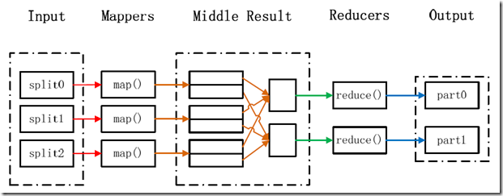

> 

> 1. 在hadoop上使用hbase数据库，因为hbase是不走Map/Reduce的，所以操作可以达到毫秒级。
> 2. 将业务数据用程序分成实时数据和冷数据，实时数据存于关系数据库，冷数据存到hadoop。比如：将最近一个月的数据存到关系数据库，用做实时响应业务处理。将一个月以前的数据存到hadoop，用作历史数据查询以及统计分析，数据挖掘等。

## MapReduce编程模型

MapReduce采用"分而治之"的思想，把对大规模数据集的操作，分发给一个主节点管理下的各个分节点共同完成，然后通过整合各个节点的中间结果，得到最终结果。简单地说，MapReduce就是"任务的分解与结果的汇总"。

　　在Hadoop中，用于执行MapReduce任务的机器角色有两个：一个是JobTracker；另一个是TaskTracker，JobTracker是用于调度工作的，TaskTracker是用于执行工作的。一个Hadoop集群中只有一台JobTracker。

　　在分布式计算中，MapReduce框架负责处理了并行编程中分布式存储、工作调度、负载均衡、容错均衡、容错处理以及网络通信等复杂问题，把处理过程高度抽象为两个函数：map和reduce，map负责把任务分解成多个任务，reduce负责把分解后多任务处理的结果汇总起来。

　　需要注意的是，用MapReduce来处理的数据集（或任务）必须具备这样的特点：待处理的数据集可以分解成许多小的数据集，而且每一个小数据集都可以完全并行地进行处理。

## MapReduce处理过程

在Hadoop中，每个MapReduce任务都被初始化为一个Job，每个Job又可以分为两种阶段：map阶段和reduce阶段。这两个阶段分别用两个函数表示，即map函数和reduce函数。map函数接收一个<key,value>形式的输入，然后同样产生一个<key,value>形式的中间输出，Hadoop函数接收一个如<key,(list of values)>形式的输入，然后对这个value集合进行处理，每个reduce产生0或1个输出，reduce的输出也是<key,value>形式的。

## HBase™

Apache HBase™ is the Hadoop database, a distributed, scalable, big data store.

Use Apache HBase™ when you need random, realtime read/write access to your Big Data. This project's goal is the hosting of very large tables -- billions of rows X millions of columns -- atop clusters of commodity hardware. Apache HBase is an open-source, distributed, versioned, non-relational database modeled after Google's Bigtable: `A Distributed Storage System for Structured Data` by Chang et al. Just as Bigtable leverages the distributed data storage provided by the Google File System, Apache HBase provides Bigtable-like capabilities on top of Hadoop and HDFS.

**Feature:**

* Linear and modular scalability.
* Strictly consistent reads and writes.
* Automatic and configurable sharding of tables
* Automatic failover support between RegionServers.
* Convenient base classes for backing Hadoop MapReduce jobs with Apache HBase tables.
* Easy to use Java API for client access.
* Block cache and Bloom Filters for real-time queries.
* Query predicate push down via server side Filters
* Thrift gateway and a REST-ful Web service that supports XML, Protobuf, and binary data encoding options
* Extensible jruby-based (JIRB) shell
* Support for exporting metrics via the Hadoop metrics subsystem to files or Ganglia; or via JMX

## 

## 附

[回到目录](#top)

## 引

(1) [Hadoop: Setting up a Single Node Cluster.](http://hadoop.apache.org/docs/current/hadoop-project-dist/hadoop-common/SingleCluster.html)

(2) [HBase](https://hbase.apache.org/)

(3) [Apache HBase ™ Reference Guide](http://hbase.apache.org/book.html)

(4) 