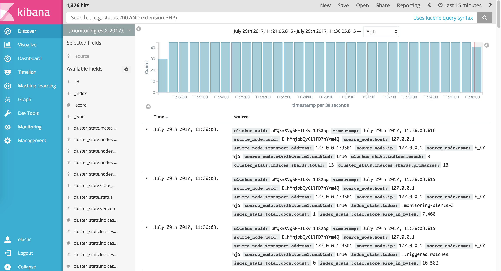

<!-- 

macdown下使用这条命令去生成toc
[toc] 
-->

* TOC
{:toc}

# 方案1-ELK

> E-elasticsearch
> L-logstash
> K-kibana

## elasticsearch

ElasticSearch是一个基于Lucene的搜索服务器。它提供了一个分布式多用户能力的全文搜索引擎，基于RESTful web接口。Elasticsearch是用Java开发的，并作为Apache许可条款下的开放源码发布，是当前流行的企业级搜索引擎。设计用于云计算中，能够达到实时搜索，稳定，可靠，快速，安装使用方便。
我们建立一个网站或应用程序，并要添加搜索功能，但是想要完成搜索工作的创建是非常困难的。我们希望搜索解决方案要运行速度快，我们希望能有一个零配置和一个完全免费的搜索模式，我们希望能够简单地使用JSON通过HTTP来索引数据，我们希望我们的搜索服务器始终可用，我们希望能够从一台开始并扩展到数百台，我们要实时搜索，我们要简单的多租户，我们希望建立一个云的解决方案。因此我们利用Elasticsearch来解决所有这些问题以及可能出现的更多其它问题。

### 特性

接近实时（NRT）
Elasticsearch是一个接近实时的搜索平台。这意味着，从索引一个文档直到这个文档能够被搜索到有一个轻微的延迟（通常是不到1秒）。
   
集群（cluster）
一个集群就是由一个或多个节点组织在一起，它们共同持有你整个的数据，并一起提供索引和搜索功能。一个集群由一个唯一的名字标识，这个名字默认就是“elasticsearch”。这个名字是重要的，因为一个节点只能通过指定某个集群的名字，来加入这个集群。在产品环境中显式地设定这个名字是一个好习惯，但是使用默认值来进行测试/开发也是不错的。
    
节点（node）
一个节点是你集群中的一个服务器，作为集群的一部分，它存储你的数据，参与集群的索引和搜索功能。和集群类似，一个节点也是由一个名字来标识的，默认情况下，这个名字是一个随机的漫威漫画角色的名字，这个名字会在启动的时候赋予节点。这个名字对于管理工作来说挺重要的，因为在这个管理过程中，你会去确定网络中的哪些服务器对应于Elasticsearch集群中的哪些节点。
    
一个节点可以通过配置集群名称的方式来加入一个指定的集群。默认情况下，每个节点都会被安排加入到一个叫做“elasticsearch”的集群中，这意味着，如果你在你的网络中启动了若干个节点，并假定它们能够相互发现彼此，它们将会自动地形成并加入到一个叫做“elasticsearch”的集群中。
    
在一个集群里，只要你想，可以拥有任意多个节点。而且，如果当前你的网络中没有运行任何Elasticsearch节点，这时启动一个节点，会默认创建并加入一个叫做“elasticsearch”的集群。
    
索引（index）    
一个索引就是一个拥有几分相似特征的文档的集合。比如说，你可以有一个客户数据的索引，另一个产品目录的索引，还有一个订单数据的索引。一个索引由一个名字来标识（必须全部是小写字母的），并且当我们要对对应于这个索引中的文档进行索引、搜索、更新和删除的时候，都要使用到这个名字。
    
在一个集群中，如果你想，可以定义任意多的索引。
    
类型（type）
在一个索引中，你可以定义一种或多种类型。一个类型是你的索引的一个逻辑上的分类/分区，其语义完全由你来定。通常，会为具有一组共同字段的文档定义一个类型。比如说，我们假设你运营一个博客平台并且将你所有的数据存储到一个索引中。在这个索引中，你可以为用户数据定义一个类型，为博客数据定义另一个类型，当然，也可以为评论数据定义另一个类型。
    
文档（document）    
一个文档是一个可被索引的基础信息单元。比如，你可以拥有某一个客户的文档，某一个产品的一个文档，当然，也可以拥有某个订单的一个文档。文档以JSON（Javascript Object Notation）格式来表示，而JSON是一个到处存在的互联网数据交互格式。
    
在一个index/type里面，只要你想，你可以存储任意多的文档。注意，尽管一个文档，物理上存在于一个索引之中，文档必须被索引/赋予一个索引的type。
    
分片和复制（shards & replicas）    
一个索引可以存储超出单个结点硬件限制的大量数据。比如，一个具有10亿文档的索引占据1TB的磁盘空间，而任一节点都没有这样大的磁盘空间；或者单个节点处理搜索请求，响应太慢。
    
为了解决这个问题，Elasticsearch提供了将索引划分成多份的能力，这些份就叫做分片。当你创建一个索引的时候，你可以指定你想要的分片的数量。每个分片本身也是一个功能完善并且独立的“索引”，这个“索引”可以被放置到集群中的任何节点上。

分片之所以重要，主要有两方面的原因：

- 允许你水平分割/扩展你的内容容量
- 允许你在分片（潜在地，位于多个节点上）之上进行分布式的、并行的操作，进而提高性能/吞吐量
        
至于一个分片怎样分布，它的文档怎样聚合回搜索请求，是完全由Elasticsearch管理的，对于作为用户的你来说，这些都是透明的。
    
在一个网络/云的环境里，失败随时都可能发生，在某个分片/节点不知怎么的就处于离线状态，或者由于任何原因消失了，这种情况下，有一个故障转移机制是非常有用并且是强烈推荐的。为此目的，Elasticsearch允许你创建分片的一份或多份拷贝，这些拷贝叫做复制分片，或者直接叫复制。
    
复制之所以重要，有两个主要原因：

- 在分片/节点失败的情况下，提供了高可用性。因为这个原因，注意到复制分片从不与原/主要（original/primary）分片置于同一节点上是非常重要的。
- 扩展你的搜索量/吞吐量，因为搜索可以在所有的复制上并行运行
    
总之，每个索引可以被分成多个分片。一个索引也可以被复制0次（意思是没有复制）或多次。一旦复制了，每个索引就有了主分片（作为复制源的原来的分片）和复制分片（主分片的拷贝）之别。分片和复制的数量可以在索引创建的时候指定。在索引创建之后，你可以在任何时候动态地改变复制的数量，但是你事后不能改变分片的数量。
        
默认情况下，Elasticsearch中的每个索引被分片5个主分片和1个复制，这意味着，如果你的集群中至少有两个节点，你的索引将会有5个主分片和另外5个复制分片（1个完全拷贝），这样的话每个索引总共就有10个分片。

## kibana
Kibana 是一个为 Logstash 和 ElasticSearch 提供的日志分析的 Web 接口。可使用它对日志进行高效的搜索、可视化、分析等各种操作。

## logstash
Logstash 是一款强大的数据处理工具，它可以实现数据传输，格式处理，格式化输出，还有强大的插件功能，常用于日志处理。

工作流程：

input 数据输入端，可以接收来自任何地方的源数据。

* file：从文件中读取
* syslog：监听在514端口的系统日志信息，并解析成RFC3164格式。
* redis：从redis-server list 中获取
* beat：接收来自Filebeat的事件

Filter 数据中转层，主要进行格式处理，数据类型转换、数据过滤、字段添加，修改等，常用的过滤器如下。

* grok: 通过正则解析和结构化任何文本。Grok 目前是logstash最好的方式对非结构化日志数据解析成结构化和可查询化。logstash内置了120个匹配模式，满足大部分需求。
* mutate: 在事件字段执行一般的转换。可以重命名、删除、替换和修改事件字段。
* drop: 完全丢弃事件，如debug事件。
* clone: 复制事件，可能添加或者删除字段。
* geoip: 添加有关IP地址地理位置信息。

output 是logstash工作的最后一个阶段，负责将数据输出到指定位置，兼容大多数应用，常用的有:
elasticsearch: 发送事件数据到 Elasticsearch，便于查询，分析，绘图。

* file: 将事件数据写入到磁盘文件上。
* mongodb:将事件数据发送至高性能NoSQL mongodb，便于永久存储，查询，分析，大数据分片。
* redis:将数据发送至redis-server，常用于中间层暂时缓存。
* graphite: 发送事件数据到graphite。http://graphite.wikidot.com/
* statsd: 发送事件数据到 statsd。

# 方案2-hadoop,hbase,hive

## hadoop

一个分布式系统基础架构，由Apache基金会所开发。用户可以在不了解分布式底层细节的情况下，开发分布式程序。充分利用集群的威力进行高速运算和存储。 Hadoop实现了一个分布式文件系统（Hadoop Distributed File System），简称HDFS。HDFS有高容错性的特点，并且设计用来部署在低廉的（low-cost）硬件上；而且它提供高传输率（high throughput）来访问应用程序的数据，适合那些有着超大数据集（large data set）的应用程序。HDFS放宽了（relax）POSIX的要求，可以以流的形式访问（streaming access）文件系统中的数据。Hadoop的框架最核心的设计就是：HDFS和MapReduce。HDFS为海量的数据提供了存储，则MapReduce为海量的数据提供了计算。

## hbase

HBase是一个分布式的、面向列的开源数据库，该技术来源于 FayChang 所撰写的Google论文“Bigtable：一个结构化数据的分布式存储系统”。就像Bigtable利用了Google文件系统（File System）所提供的分布式数据存储一样，HBase在Hadoop之上提供了类似于Bigtable的能力。HBase是Apache的hadoop项目的子项目。HBase不同于一般的关系数据库，它是一个适合于非结构化数据存储的数据库。另一个不同的是HBase基于列的而不是基于行的模式。

## hive

Hive是一个数据仓库，它部署在Hadoop集群上，它的数据是存储在HDFS上的，Hive所建的表在HDFS上对应的是一个文件夹，表的内容对应的是一个文件。它不仅可以存储大量的数据而且可以对存储的数据进行分析，但它有个缺点就是不能实时的更新数据，无法直接修改和删除数据，如果想要修改数据需要先把数据所在的文件下载下来，修改完之后再上传上去。Hive的语法非常类似于我们的MySQL语句，所以上起手来特别容易。HIve特别神奇的地方是我们只需写一条SQL语句它就会自动转换为MapReduce任务去执行，不用我们再手动去写MapReduce了。

# 方案对比

Hadoop在设计上就是一个分布式的，面向批处理的平台，用以处理大数据集。虽然它是一个非常强大的工具，但它的批处理的本质意味着在处理结果时需要花费一定时间。此外，用户必需重新为各种操作编写代码。Hive或者Pig这样的类库能起到一定作用，但不能完全解决问题，想象一下在Map/Reduce中重新实现地理位置查询的难度吧。

而使用Elasticsearch，你就可以将搜索工作交给搜索引擎去完成，而专注于其它方面的工作，例如数据转换。Elasticsearch-Hadoop项目为Hadoop提供了直接的整合功能，因此用户使用起来没有任何障碍，我们为vanilla Map/Reduce提供了专门的InputFormat与OutputFormat，为Cascading的数据读写提供了Taps，并为Pig和Hive提供了Storages。这样你就可以以HDFS一样方式的访问Elasticsearch的数据了。

通常来说，与Hadoop进行整合的数据存储系统都可能会成为系统的瓶颈，这是由于每个job在集群中的各种任务会造成大量的请求。而Map/Reduce模型的分布式特性用于Elasticsearch上会配合得非常良好，因为我们能够将某个特定查询所生产的Map/Reduce任务数量与Elasticsearch的分片数量相关联。这样每次有查询运行时，系统就会动态地按照Hadoop的划分生成一个数值，该数值与Elasticsearch的可用分片数量成正比，这样各个job就能够并行地运行了。你可以按照Elasticsearch的数量对Hadoop集群进行扩展，或者是反过来也可以。

此外，这种整合将分片的信息暴露给Hadoop，以此可以实现协同定位。Job的任务会在每个Elasticsearch分片所在的同一台机器上运行，通过实现数据本地化消除了网络的开销，并改善了性能。出于这个原因，我们建议你在相同的机器上运行Elasticsearch和Hadoop集群，尤其是他们能够互相平衡资源的使用情况（I/O与CPU）。

最后但也是很重要的一点是，Elasticsearch能够提供近乎实时的响应速度（毫秒等级），这极大的改善了Hadoop job的执行速度以及执行的各种开销，在类似于Amazon EMR这种“租用的资源”上运行时的改善尤其明显。

# 本公司应用场合

基本现在在的数据容量来说，用hadoop或spark有点过于庞大了，而elasticsearch是现在衣布到位应用的比较多，也比较熟练。数据的导入可以进一步研究logstash对excel的扩展，或是直接使用java写出数据读入接口，将数据读入elasticsearch。最大化elastic的搜索与聚合作用，完全可以满足现有的业务需求。而且hadoop在搜索上肯定是比不上elasticsearch的。相对来说elk的轻量级，易布署都比较贴合公司的实际应用场景。
比如，可以采用spring-boot搭建的web后台框架，处理一些输入及格式化输出，到定制化的前端。

## 附

[回到目录](#markdown-toc)

## 引

(1) [Hadoop: Setting up a Single Node Cluster.](http://hadoop.apache.org/docs/current/hadoop-project-dist/hadoop-common/SingleCluster.html)

(2) [HBase](https://hbase.apache.org/)

(3) [Apache HBase™ Reference Guide](http://hbase.apache.org/book.html)

(4) [elastic offical website](https://www.elastic.co/)