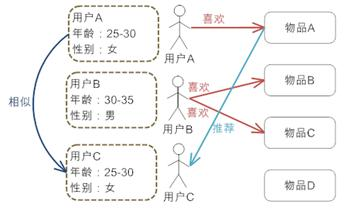
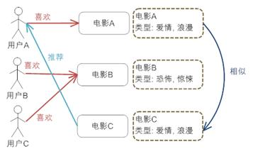
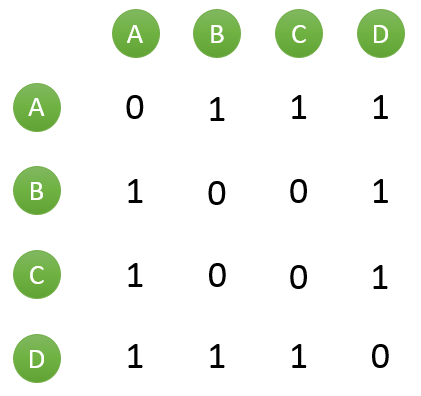
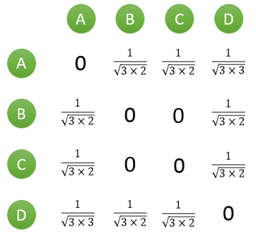

<!-- 

macdown下使用这条命令去生成toc
[toc] 
-->

* TOC
{:toc}

> 推荐系统的任务就是解决，当用户无法准确描述自己的需求时，搜索引擎的筛选效果不佳的问题。联系用户和信息，一方面帮助用户发现对自己有价值的信息，另一方面让信息能够展现在对他感兴趣的人群中，从而实现信息提供商与用户的双赢。

## 推荐算法介绍

### 基于人口统计学的推荐

这是最为简单的一种推荐算法，它只是简单的根据系统用户的基本信息发现用户的相关程度，然后将相似用户喜爱的其他物品推荐给当前用户。

系统首先会根据用户的属性建模，比如用户的年龄，性别，兴趣等信息。根据这些特征计算用户间的相似度。比如系统通过计算发现用户A和C比较相似。就会把A喜欢的物品推荐给C。

优缺点：

* 不需要历史数据，没有冷启动问题
* 不依赖于物品的属性，因此其他领域的问题都可无缝接入。
* 算法比较粗糙，效果很难令人满意，只适合简单的推荐

### 基于内容的推荐

与上面的方法相类似，只不过这次的中心转到了物品本身。使用物品本身的相似度而不是用户的相似度。

系统首先对物品（图中举电影的例子）的属性进行建模，图中用类型作为属性。在实际应用中，只根据类型显然过于粗糙， 还需要考虑演员，导演等更多信息。通过相似度计算，发现电影A和C相似度较高，因为他们都属于爱情类。系统还会发现用户A喜欢电影A，由此得出结论，用户 A很可能对电影C也感兴趣。于是将电影C推荐给A。

优缺点：

* 对用户兴趣可以很好的建模，并通过对物品属性维度的增加，获得更好的推荐精度
* 物品的属性有限，很难有效的得到更多数据
* 物品相似度的衡量标准只考虑到了物品本身，有一定的片面性
* 需要用户的物品的历史数据，有冷启动的问题

### 协同过滤

协同过滤是推荐算法中最经典最常用的，分为基于用户的协同过滤和基于物品的协同过滤。那么他们和基于人口学统计的推荐和基于内容的推荐有什么区别和联系呢？

基于用户的协同过滤——基于人口统计学的推荐

基于用户的协同过滤推荐机制和基于人口统计学的推荐机制都是计算用户的相似度，并基于“邻居”用户群计算推荐，但它 们所不同的是如何计算用户的相似度，基 于人口统计学的机制只考虑用户本身的特征，而基于用户的协同过滤机制可是在用户的历史偏好的数据上计算用户的相似度，它的基本假设是，喜欢类似物品的用户 可能有相同或者相似的口味和偏好。

基于物品的协同过滤——基于内容的推荐

基于项目的协同过滤推荐和基于内容的推荐其实都是基于物品相似度预测推荐，只是相似度计算的方法不一样，前者是从用户历史的偏好推断，而后者是基于物品本身的属性特征信息。

协同过滤的优势：

* 它不需要对物品或者用户进行严格的建模，而且不要求物品的描述是机器可理解的，所以这种方法也是领域无关的。
* 这种方法计算出来的推荐是开放的，可以共用他人的经验，很好的支持用户发现潜在的兴趣偏好

协同过滤的缺点：

* 方法的核心是基于历史数据，所以对新物品和新用户都有“冷启动”的问题
* 推荐的效果依赖于用户历史偏好数据的多少和准确性
* 在大部分的实现中，用户历史偏好是用稀疏矩阵进行存储的，而稀疏矩阵上的计算有些明显的问题，包括可能少部分人的错误偏好会对推荐的准确度有很大的影响等等
* 对于一些特殊品味的用户不能给予很好的推荐
* 由于以历史数据为基础，抓取和建模用户的偏好后，很难修改或者根据用户的使用演变，从而导致这个方法不够灵活

### 混合推荐算法

以上介绍的方法是推荐领域最常见的几种方法。但是可以看出，每个方法都不是完美的。因此实际应用中都是混合使用各种推荐算法，各取所长。我们的大量医疗数据中，也可以多考虑一下什么情况下更适合使用哪种推荐算法，能更好的为医生提供诊断信息

协同过滤推荐算法原理和实现

在推荐系统众多方法中，基于用户的协同过滤推荐算法是最早诞生的，原理也较为简单。该算法1992年提出并用于邮件过滤系统。可以将基于用户的协同过滤推荐算法拆分为两个步骤：

找到与目标用户兴趣相似的用户集合
找到这个集合中用户喜欢的、并且目标用户没有听说过的物品推荐给目标用户
发现兴趣相似的用户

通常用$Jaccard$公式或者`余弦相似度`计算两个用户之间的相似度。设 $N(u)$ 为用户 $u$ 喜欢的物品集合，$N(v)$ 为用户 $v$ 喜欢的物品集合，那么 $u$ 和 $v$ 的相似度是多少呢?

`Jaccard` 公式：

$$
J(N(u),N(v)) = \frac{|N(u) \cap N(v)|}{|N(u) \cup N(v)|}
$$

具体可以参考

[python：距离实现综述](/blog/python-distance-overview.html)

假设目前共有4个用户： A、B、C、D；共有5个物品：a、b、c、d、e。用户与物品的关系（用户喜欢物品）如下图所示：

|  A | a  |b |d |
| ------------ | ------------ |------------ |------------ |
| B  |  a |c | |
| C  | b  |e | |
| D  | c  |d |e |

如何一下子计算所有用户之间的相似度呢？为计算方便，通常首先需要建立“物品—用户”的倒排表，如下图所示：

|  a | A  |B |
| ------------ | ------------ |------------ |
| b  |  A |C | 
| c  | B  |D | 
| d  | A  |D |
| e  | C  |D |

然后对于每个物品，喜欢他的用户，两两之间相同物品加1。例如喜欢物品 a 的用户有 A 和 B，那么在矩阵中他们两两加1。如下图所示：

计算用户两两之间的相似度，上面的矩阵仅仅代表的是公式的分子部分。以余弦相似度为例，对上图进行进一步计算：

到此，计算用户相似度就大功告成，可以很直观的找到与目标用户兴趣较相似的用户。

推荐物品

首先需要从矩阵中找出与目标用户 u 最相似的 K 个用户，用集合 S(u, K) 表示，将 S 中用户喜欢的物品全部提取出来，并去除 u 已经喜欢的物品。对于每个候选物品 i ，用户 u 对它感兴趣的程度用如下公式计算：

$$
p(u,i) = \sum_{v \in S(u,K) \cap N(i)}w_{u_v}r_{v_i}
$$

其中 $r_{v_i}$ 表示用户 $v$ 对 $i$ 的喜欢程度，在本例中都是为 **1**，在一些需要用户给予评分的推荐系统中，则要代入用户评分。

举个例子，假设我们要给 $A$ 推荐物品，选取 $K = 3 $个相似用户，相似用户则是：B、C、D，那么他们喜欢过并且 $A$ 没有喜欢过的物品有：$c$、$e$，那么分别计算 $p(A, c)$ 和 $p(A, e)$：

$$
P(A,c) = W_{AB} + W_{AD} = \frac{1}{\sqrt{6}} + \frac{1}{\sqrt{9}} = 0.7416
$$

$$
P(A,e) = W_{AC} + W_{AD} = \frac{1}{\sqrt{6}} + \frac{1}{\sqrt{9}} = 0.7416
$$

看样子用户$ A$ 对 $c$ 和 $e$ 的喜欢程度可能是一样的，在真实的推荐系统中，只要按得分排序，取前几个物品就可以了。

## 附

[回到目录](#markdown-toc)

## 引用

(1) [推荐系统的常用算法原理和实现](http://blog.csdn.net/xsl_bj/article/details/51120643)
