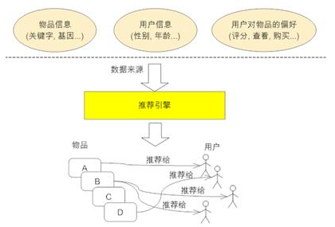

<!-- 
<span id="top"></span>
macdown下使用这条命令去生成toc
[toc] 
-->

* TOC
{:toc}

> 推荐系统的任务就是解决，当用户无法准确描述自己的需求时，搜索引擎的筛选效果不佳的问题。联系用户和信息，一方面帮助用户发现对自己有价值的信息，另一方面让信息能够展现在对他感兴趣的人群中，从而实现信息提供商与用户的双赢。
> 推荐引擎，是建立在对每一个用户的信息和行为深刻了解的基础之上，为用户提供个人化信息的技术，它不是被动等待用户的搜索请求，而是为用户主动推送最相关的信息。

## 推荐引擎工作原理
下图展示了推荐系统（或称推荐引擎）的工作原理。它的输入是推荐的数据源，一般情况下，推荐引擎所需要的数据源包括：

* 要推荐物品或内容的元数据，例如关键字，基本描述等；
* 系统用户的基本信息，例如性别，年龄等；
* 用户对物品或者信息的偏好，例如用户对物品的评分，用户查看物品的记录，用户的购买记录等。



推荐引擎根据不同的推荐机制可能用到数据源中的一部分或全部，然后在这些数据的基础上结合推荐算法将不同信息推荐给不同用户。

## 推荐算法介绍

### 基于人口统计学的推荐

这是最为简单的一种推荐算法，它只是简单的根据系统用户的基本信息发现用户的相关程度，然后将相似用户喜爱的其他物品推荐给当前用户。


系统首先会根据用户的属性建模，比如用户的年龄，性别，兴趣等信息。根据这些特征计算用户间的相似度。比如系统通过计算发现用户A和C比较相似。就会把A喜欢的物品推荐给C。

优缺点：

* 不需要历史数据，没有冷启动问题
* 不依赖于物品的属性，因此其他领域的问题都可无缝接入。
* 算法比较粗糙，效果很难令人满意，只适合简单的推荐

### 基于内容的推荐

与上面的方法相类似，只不过这次的中心转到了物品本身。使用物品本身的相似度而不是用户的相似度。


系统首先对物品（图中举电影的例子）的属性进行建模，图中用类型作为属性。在实际应用中，只根据类型显然过于粗糙， 还需要考虑演员，导演等更多信息。通过相似度计算，发现电影A和C相似度较高，因为他们都属于爱情类。系统还会发现用户A喜欢电影A，由此得出结论，用户 A很可能对电影C也感兴趣。于是将电影C推荐给A。

优缺点：

* 对用户兴趣可以很好的建模，并通过对物品属性维度的增加，获得更好的推荐精度
* 物品的属性有限，很难有效的得到更多数据
* 物品相似度的衡量标准只考虑到了物品本身，有一定的片面性
* 需要用户的物品的历史数据，有冷启动的问题

### 协同过滤（Collaborative Filtering recommendation）

>协同过滤推荐（Collaborative Filtering recommendation，后文简称CF）在信息过滤和信息系统中正迅速成为一项很受欢迎的技术。与传统的基于内容过滤直接分析内容进行推荐不同，协同过滤分析用户兴趣，在用户群中找到指定用户的相似（兴趣）用户，综合这些相似用户对某一信息的评价，形成系统对该指定用户对此信息的喜好程度预测。

从上面的定义可以看出，协同过滤是一种集体智慧的体现，也就是基于兴趣群体的推荐技术。例如，你现在想观看一部新电影，但并不知道看哪一部。这种时候，大部分人都会选择询问有相同电影偏好的朋友，让他们推荐一两部电影。这便是协同过滤的集体智慧体现。

从上面咨询朋友进行电影推荐的例子中，我们可以粗略总结出协同过滤推荐的步骤：

* 根据历史资料总结出用户偏好或者资料特征；
* 计算需要推荐的对象相似度；
* 进行推荐。

不难发现，整个算法有两个难点：

* 如何计算对象间的相似度；
* 相似度计算完之后，如何找到对象的邻居。

这里推荐三种相似度计算：

* Euclidean Distance
* Pearson Correlation Coefficient
* Cosine Similarity

具体参考另一篇博文：[距离综述](/blog/python-distance-overview.html)

常用的计算相似邻居的算法有两种：

* k近邻（K-neighborhoods），在另外一篇博文也讨论过了
* 基于相似度门槛的邻居（Threshold-based neighborhoods ）


协同过滤是推荐算法中最经典最常用的，分为基于用户的协同过滤和基于物品的协同过滤。那么他们和基于人口学统计的推荐和基于内容的推荐有什么区别和联系呢？

基于用户的协同过滤——基于人口统计学的推荐

基于用户的协同过滤推荐机制和基于人口统计学的推荐机制都是计算用户的相似度，并基于“邻居”用户群计算推荐，但它 们所不同的是如何计算用户的相似度，基 于人口统计学的机制只考虑用户本身的特征，而基于用户的协同过滤机制可是在用户的历史偏好的数据上计算用户的相似度，它的基本假设是，喜欢类似物品的用户 可能有相同或者相似的口味和偏好。

基于物品的协同过滤——基于内容的推荐

基于项目的协同过滤推荐和基于内容的推荐其实都是基于物品相似度预测推荐，只是相似度计算的方法不一样，前者是从用户历史的偏好推断，而后者是基于物品本身的属性特征信息。

协同过滤的优势：

* 它不需要对物品或者用户进行严格的建模，而且不要求物品的描述是机器可理解的，所以这种方法也是领域无关的。
* 这种方法计算出来的推荐是开放的，可以共用他人的经验，很好的支持用户发现潜在的兴趣偏好

协同过滤的缺点：

* 方法的核心是基于历史数据，所以对新物品和新用户都有“冷启动”的问题
* 推荐的效果依赖于用户历史偏好数据的多少和准确性
* 在大部分的实现中，用户历史偏好是用稀疏矩阵进行存储的，而稀疏矩阵上的计算有些明显的问题，包括可能少部分人的错误偏好会对推荐的准确度有很大的影响等等
* 对于一些特殊品味的用户不能给予很好的推荐
* 由于以历史数据为基础，抓取和建模用户的偏好后，很难修改或者根据用户的使用演变，从而导致这个方法不够灵活


#### 两种协同过滤算法的比较

社交类网站如，微博，facebook。这类网站有一个特点，用户数目到达一定程度之后会保持稳定，但物品（这里指网站上的各类新闻资讯，应用等）的数目却一直保持快速增长，否则肯定会造成用户流失。对于这类网站，User CF比较适用，因为Item CF的计算量由于物品的不断增加而十分大。反而User CF计算量会小很多。

而对于非社交类网站如电子商务购物平台，用户的数量往往大大超过物品的数量，同时物品的数据相对稳定，因此计算物品的相似度不但计算量较小，同时也不必频繁更新。

此外这两种算法也存在不同的使用场景，举例说明。当给用户推荐一个新款包包的时候，根据User CF给用户的提示是：与你有相同爱好的“XXX”用户也喜欢这个包包，这时用户的反应是“XXX”是谁，跟我有什么关系。不同的是，根据Item CF给用户的提示会是：根据您以前的购物记录我们猜你喜欢这个包包，这时用户也许就会点击进去浏览甚至购买。

当然除了上述两种应用方式，Item CF对于推荐结果的多样性会比User CF差不少。因此在应用协同过滤算法的时候，开发人员需要结合实际应用场景选择不同算法，甚至选择混合协同过滤，这样会取得更好的推荐效果，所带来的收益也会增加。

#### java实现

这里给出了基于用户的协同过滤算法简单实现，在相似度计算上采用皮尔逊相关系数。

```java
/**
 * @name:CF algorithm
 * @author:希慕_North
 * @function:User-based Collaborative Filtering algorithm.
 * @date:09/04/2015
 */

package RS;

import java.util.ArrayList;
import java.util.Collections;
import java.util.Comparator;
import java.util.HashMap;
import java.util.List;
import java.util.Map;
import java.util.Map.Entry;

public class CF {

    public static void main(String[] args) {
        Map<String, Map<String, Integer>> userPerfMap = new HashMap<String, Map<String, Integer>>();
        Map<String, Integer> pref1 = new HashMap<String, Integer>();
        pref1.put("A", 3);
        pref1.put("B", 4);
        pref1.put("C", 3);
        pref1.put("D", 5);
        pref1.put("E", 1);
        pref1.put("F", 4);
        userPerfMap.put("p1", pref1);
        Map<String, Integer> pref2 = new HashMap<String, Integer>();
        pref2.put("A", 2);
        pref2.put("B", 4);
        pref2.put("C", 4);
        pref2.put("D", 5);
        pref2.put("E", 3);
        pref2.put("F", 2);
        userPerfMap.put("p2", pref2);
        Map<String, Integer> pref3 = new HashMap<String, Integer>();
        pref3.put("A", 3);
        pref3.put("B", 5);
        pref3.put("C", 4);
        pref3.put("D", 5);
        pref3.put("E", 2);
        pref3.put("F", 1);
        userPerfMap.put("p3", pref3);
        Map<String, Integer> pref4 = new HashMap<String, Integer>();
        pref4.put("A", 2);
        pref4.put("B", 2);
        pref4.put("C", 3);
        pref4.put("D", 4);
        pref4.put("E", 3);
        pref4.put("F", 2);
        userPerfMap.put("p4", pref4);
        Map<String, Integer> pref5 = new HashMap<String, Integer>();
        pref5.put("A", 4);
        pref5.put("B", 4);
        pref5.put("C", 4);
        pref5.put("D", 5);
        pref5.put("E", 1);
        pref5.put("F", 0);
        userPerfMap.put("p5", pref5);

        Map<String, Double> simUserSimMap = new HashMap<String, Double>();
        System.out.println("皮尔逊相关系数:");

        for (Entry<String, Map<String, Integer>> userPerfEn : userPerfMap.entrySet()) {
            String userName = userPerfEn.getKey();
            if (!"p5".equals(userName)) {
                double sim = getUserSimilar(pref5, userPerfEn.getValue());
                System.out.println("    p5与" + userName + "之间的相关系数:" + sim);
                simUserSimMap.put(userName, sim);
            }
        }

        Map<String, Map<String, Integer>> simUserObjMap = new HashMap<String, Map<String, Integer>>();
        Map<String, Integer> pobjMap1 = new HashMap<String, Integer>();
        pobjMap1.put("玩命速递", 3);
        pobjMap1.put("环太平洋", 4);
        pobjMap1.put("变形金刚", 3);
        simUserObjMap.put("p1", pobjMap1);
        Map<String, Integer> pobjMap2 = new HashMap<String, Integer>();
        pobjMap2.put("玩命速递", 5);
        pobjMap2.put("环太平洋", 1);
        pobjMap2.put("变形金刚", 2);
        simUserObjMap.put("p2", pobjMap2);
        Map<String, Integer> pobjMap3 = new HashMap<String, Integer>();
        pobjMap3.put("玩命速递", 2);
        pobjMap3.put("环太平洋", 5);
        pobjMap3.put("变形金刚", 5);
        simUserObjMap.put("p3", pobjMap3);

        System.out.println("推荐结果:" + getRecommend(simUserObjMap, simUserSimMap));
    }

    //Claculate Pearson Correlation Coefficient
    public static double getUserSimilar(Map<String, Integer> pm1, Map<String, Integer> pm2) {
        int n = 0;// 数量n
        int sxy = 0;// Σxy=x1*y1+x2*y2+....xn*yn
        int sx = 0;// Σx=x1+x2+....xn
        int sy = 0;// Σy=y1+y2+...yn
        int sx2 = 0;// Σx2=(x1)2+(x2)2+....(xn)2
        int sy2 = 0;// Σy2=(y1)2+(y2)2+....(yn)2
        for (Entry<String, Integer> pme : pm1.entrySet()) {
            String key = pme.getKey();
            Integer x = pme.getValue();
            Integer y = pm2.get(key);
            if (x != null && y != null) {
                n++;
                sxy += x * y;
                sx += x;
                sy += y;
                sx2 += Math.pow(x, 2);
                sy2 += Math.pow(y, 2);
            }
        }
        // p=(Σxy-Σx*Σy/n)/Math.sqrt((Σx2-(Σx)2/n)(Σy2-(Σy)2/n));
        double sd = sxy - sx * sy / n;
        double sm = Math.sqrt((sx2 - Math.pow(sx, 2) / n) * (sy2 - Math.pow(sy, 2) / n));
        return Math.abs(sm == 0 ? 1 : sd / sm);
    }

    //get recommendation results
    public static String getRecommend(Map<String, Map<String, Integer>> simUserObjMap,
            Map<String, Double> simUserSimMap) {
        Map<String, Double> objScoreMap = new HashMap<String, Double>();
        for (Entry<String, Map<String, Integer>> simUserEn : simUserObjMap.entrySet()) {
            String user = simUserEn.getKey();
            double sim = simUserSimMap.get(user);
            for (Entry<String, Integer> simObjEn : simUserEn.getValue().entrySet()) {
                double objScore = sim * simObjEn.getValue();
                String objName = simObjEn.getKey();
                if (objScoreMap.get(objName) == null) {
                    objScoreMap.put(objName, objScore);
                } else {
                    double totalScore = objScoreMap.get(objName);
                    objScoreMap.put(objName, totalScore + objScore);
                }
            }
        }
        List<Entry<String, Double>> enList = new ArrayList<Entry<String, Double>>(objScoreMap.entrySet());
        Collections.sort(enList, new Comparator<Map.Entry<String, Double>>() {
            public int compare(Map.Entry<String, Double> o1, Map.Entry<String, Double> o2) {
                Double a = o1.getValue() - o2.getValue();
                if (a == 0) {
                    return 0;
                } else if (a > 0) {
                    return 1;
                } else {
                    return -1;
                }
            }
        });
        return enList.get(enList.size() - 1).getKey();
    }
}
```

### 混合推荐算法

以上介绍的方法是推荐领域最常见的几种方法。但是可以看出，每个方法都不是完美的。因此实际应用中都是混合使用各种推荐算法，各取所长。我们的大量医疗数据中，也可以多考虑一下什么情况下更适合使用哪种推荐算法，能更好的为医生提供诊断信息

协同过滤推荐算法原理和实现

在推荐系统众多方法中，基于用户的协同过滤推荐算法是最早诞生的，原理也较为简单。该算法1992年提出并用于邮件过滤系统。可以将基于用户的协同过滤推荐算法拆分为两个步骤：

找到与目标用户兴趣相似的用户集合
找到这个集合中用户喜欢的、并且目标用户没有听说过的物品推荐给目标用户
发现兴趣相似的用户

假设目前共有4个用户： A、B、C、D；共有5个物品：a、b、c、d、e。用户与物品的关系（用户喜欢物品）如下图所示：

|  A | a  |b |d |
| ------------ | ------------ |------------ |------------ |
| B  |  a |c | |
| C  | b  |e | |
| D  | c  |d |e |

如何一下子计算所有用户之间的相似度呢？为计算方便，通常首先需要建立“物品—用户”的倒排表，如下图所示：

|  a | A  |B |
| ------------ | ------------ |------------ |
| b  |  A |C | 
| c  | B  |D | 
| d  | A  |D |
| e  | C  |D |

然后对于每个物品，喜欢他的用户，两两之间相同物品加1。例如喜欢物品 a 的用户有 A 和 B，那么在矩阵中他们两两加1。如下图所示：


计算用户两两之间的相似度，上面的矩阵仅仅代表的是公式的分子部分。以余弦相似度为例，对上图进行进一步计算：


到此，计算用户相似度就大功告成，可以很直观的找到与目标用户兴趣较相似的用户。

推荐物品

首先需要从矩阵中找出与目标用户 u 最相似的 K 个用户，用集合 S(u, K) 表示，将 S 中用户喜欢的物品全部提取出来，并去除 u 已经喜欢的物品。对于每个候选物品 i ，用户 u 对它感兴趣的程度用如下公式计算：

$$
p(u,i) = \sum_{v \in S(u,K) \cap N(i)}w_{u_v}r_{v_i}
$$

其中 $r_{v_i}$ 表示用户 $v$ 对 $i$ 的喜欢程度，在本例中都是为 **1**，在一些需要用户给予评分的推荐系统中，则要代入用户评分。

举个例子，假设我们要给 $A$ 推荐物品，选取 $K = 3 $个相似用户，相似用户则是：B、C、D，那么他们喜欢过并且 $A$ 没有喜欢过的物品有：$c$、$e$，那么分别计算 $p(A, c)$ 和 $p(A, e)$：

$$
P(A,c) = W_{AB} + W_{AD} = \frac{1}{\sqrt{6}} + \frac{1}{\sqrt{9}} = 0.7416
$$

$$
P(A,e) = W_{AC} + W_{AD} = \frac{1}{\sqrt{6}} + \frac{1}{\sqrt{9}} = 0.7416
$$

看样子用户$ A$ 对 $c$ 和 $e$ 的喜欢程度可能是一样的，在真实的推荐系统中，只要按得分排序，取前几个物品就可以了。


## 附

[回到目录](#markdown-toc)

## 引用

(1) [推荐系统的常用算法原理和实现](http://blog.csdn.net/xsl_bj/article/details/51120643)

(2) [推荐引擎之协同过滤算法——深度剖析及源码实现](http://blog.csdn.net/yangmuted/article/details/48197129)

(3) [协同过滤](https://www.ibm.com/developerworks/cn/web/1103_zhaoct_recommstudy2/index.html)