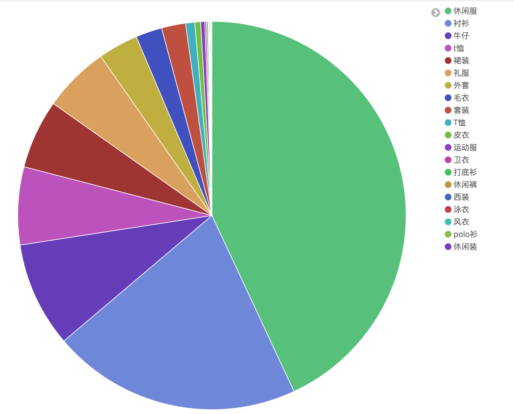
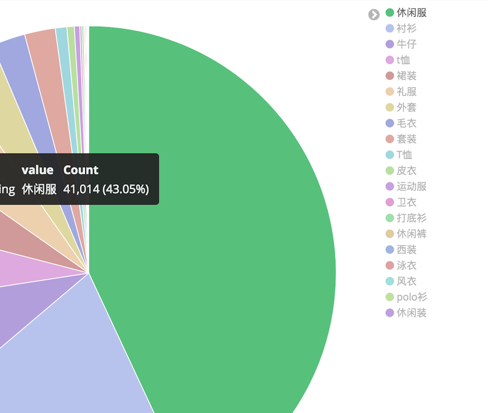
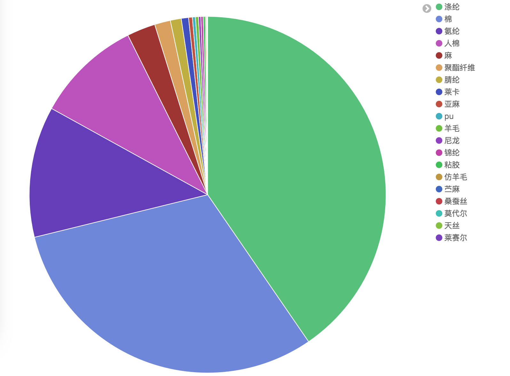
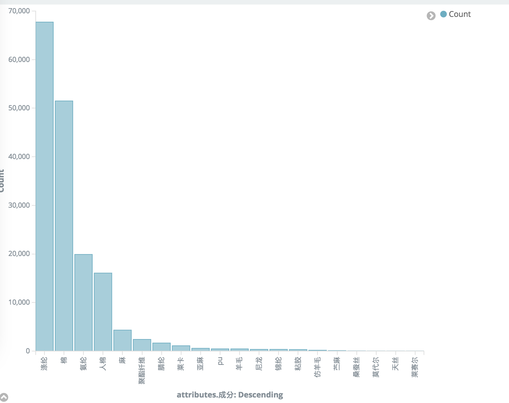
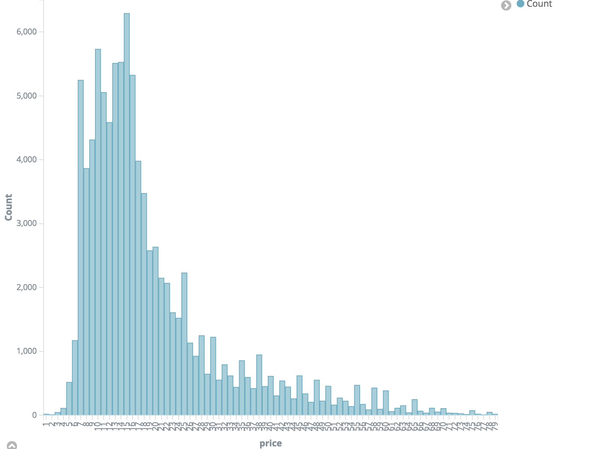
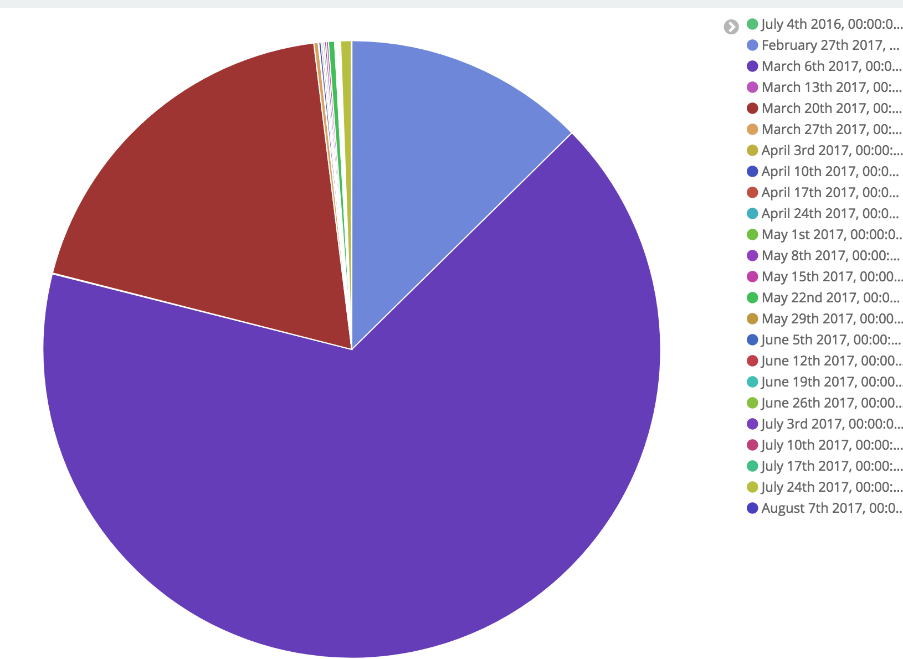
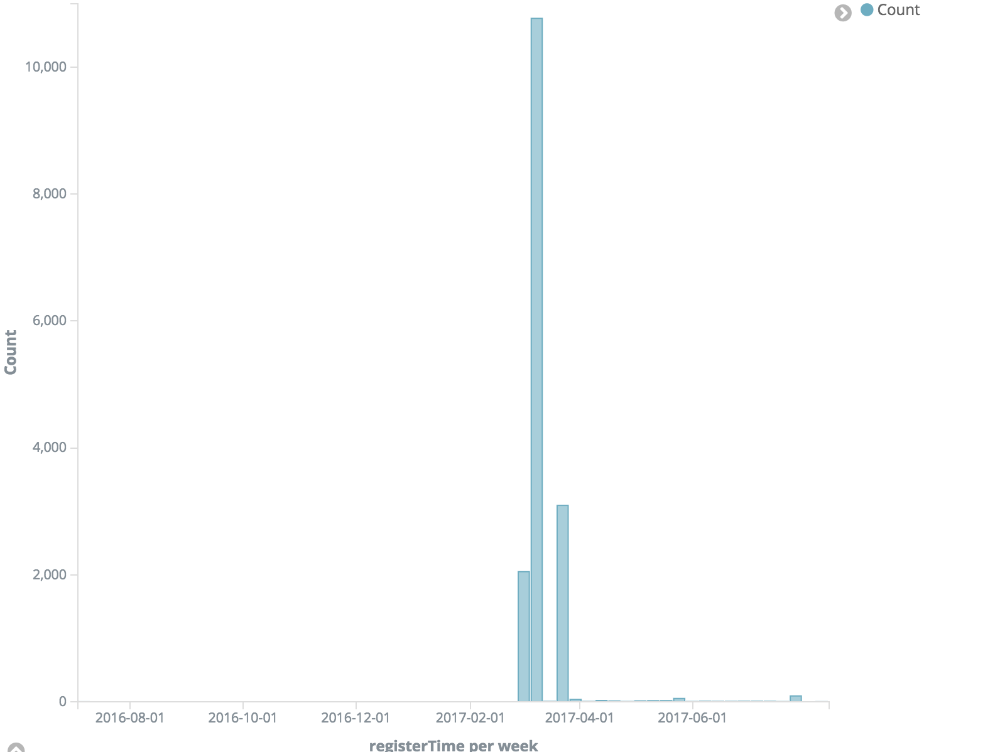
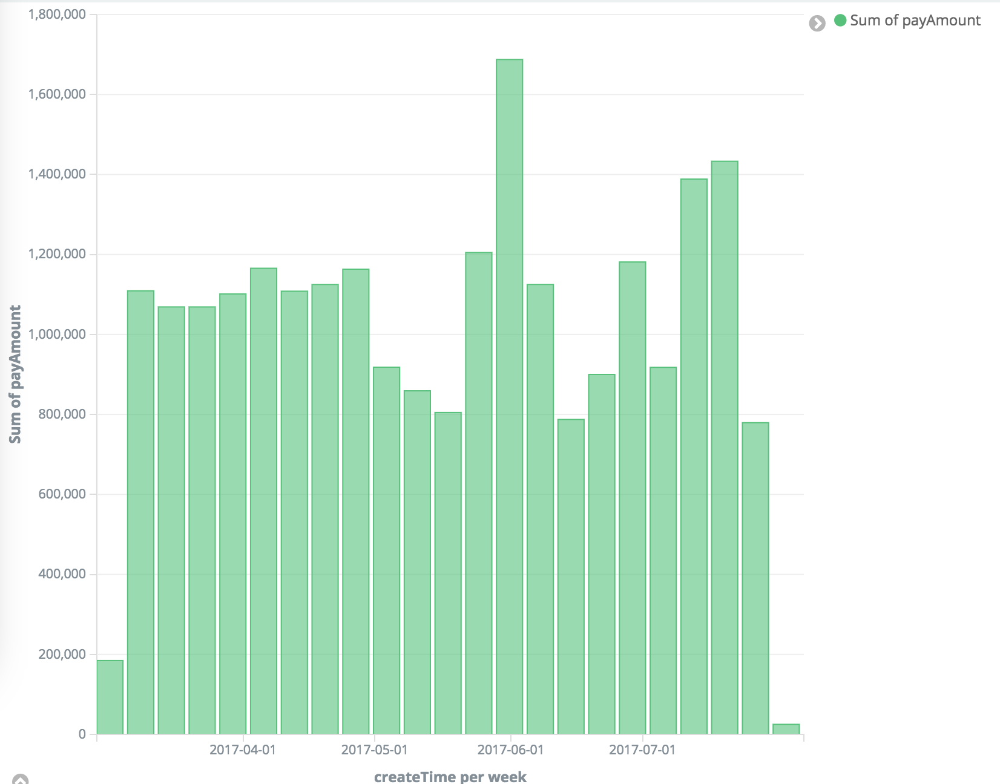
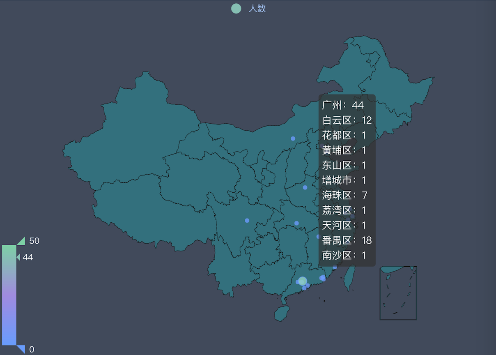

<!--<span id="top"></span>

macdown下使用这条命令去生成toc 

[toc] -->


* TOC
{:toc}

## 数据分析系统构成

* 开发语言：Java 1.8
* 后台框架：Springboot 2.0.0.M3 
* 搜索组件：ElasticSearch 5.5.1
* UI组件：Kibana 5.5.1, echarts
* 数据来源: Mysql测试数据库

> 其中UI组件使用kibana做一些原型展示，应用的时候可以改为定制的展示形式

## 示例数据及统计展示

### 布料数据

来源：表`T_Cloth_Text_Increment`，数据量 9.5W

单条记录示例：

``` sql
productId	indexData	operation	status	createTime	updateTime
179287	{"productCode":"T1358F","productId":179287,"updated_at":"2017-03-29T12:00:49","price":11.0,"name":"","alias":"人棉","created_at":"2017-03-22T21:57:52","attributes":{"产地":["中国"],"人群":["通用"],"用途":["衬衫"],"功能":["吸湿"],"季节":["四季"],"成分":["人棉"],"织物":["梭织"],"时效":["常规"],"工艺":["染色"]},"status":1}	2	1	2017-05-31 17:14:12	2017-05-31 17:14:12
```

展示`用途`分布：





展示布料`成分`分布·TOP20



采用**柱状图**展示：



布料`价格`分布柱状图 * [1,80]



布料`功能`标签云展示


### 用户数据

来源：表`T_User`，数据 16241

单条记录示例：

```sql
userId	roleType	userName	password	status	registerTime	updateTime	totalBalance	totalIncome	totalSettled	totalScore	uacId	belongsId	creatorId	name	tel	headPortrait	nickName	sex	address	email	introduce	priceStrategy	source
10191	0	15876433916	43a52b6a5c14e90626d7c20b4878d918	0	2017-03-03 20:40:26	2017-03-03 20:40:26	0.00	0.00	0.00	0	0	0	0	NULL	NULL	NULL	NULL	0	NULL	NULL	NULL	0	0
```

这里没什么好分析的，展示一下注册时间分布，数据大部分来源于导入，故有很多数据的时间相同。





### 订单数据

来源：表`T_Order`，数据 828

单条记录示例：

```sql
orderId	userId	status	orderAmount	payAmount	couponAmount	cneeName	cneeAddr	cneePhone	createTime	payTime	trackingNum	deliType	deliCom	packWeight	freight	image	note	updateTime	itemStr	imageId	appName	couponId	invoiceContent	productType	adjustAmount	invoiceAmount	invoiceTitle	invoiceType	payWay	agentCommission	purchased	serviceNote	customOrderId	customizeType	manufactureStatusStr	deliveryDate	syncTimeOMS	syncMsgOMS
119386	27104	3	32671.00	32671.00	0.00	邓总		13699743416	2017-07-04 14:55:19	2017-07-04 14:55:19	NULL	NULL	NULL	NULL	NULL	NULL	NULL	2017-07-04 14:55:19	[{"number":1766,"product":{"catList":[],"supplierId":142,"skuList":[{"images":[{"image":"http://mprod-10039477.image.myqcloud.com/310a3b5f-9972-4ce1-aa48-1ec28d2abef5","imageId":990778,"sn":0,"imgType":1}],"productId":211227,"name":"无","stock":866,"skuId":232007,"skuCode":"A10052-E12226-11-1","ebspuId":89077},{"images":[{"image":"http://mprod-10039477.image.myqcloud.com/a676f3fc-27f9-4c10-8f77-b3406917a278","imageId":990779,"sn":0,"imgType":1}],"productId":211227,"name":"无","stock":955,"skuId":232008,"skuCode":"A10052-E12226-11-2","ebspuId":89077}],"scoringList":[],"traderId":12238,"propertieList":{"77":{"name":"功能","value":["吸湿透气"]},"67":{"name":"织物","value":["梭织"]},"23":{"name":"工艺","value":["染色"]},"90":{"name":"人群","value":["通用"]},"999":{"name":"触感","value":[]},"95":{"name":"用途","value":["休闲服"]}},"saleUnit":1,"productName":"","minOrder":0,"priceList":[{"productId":211227,"salePrice":18.5,"priceType":1,"ebspuId":89077},{"productId":211227,"salePrice":38.5,"priceType":2,"ebspuId":89077},{"productId":211227,"salePrice":0.0,"priceType":3,"ebspuId":89077}],"paper":0.0,"providerId":14040,"price":18.5,"brand":"","popType":0,"providerName":"翰宇纺织","productType":6,"maxWidth":0.0,"aliasName":"斜纹布","productId":211227,"gross":0.0,"appName":3,"weight":0.0,"updateTime":1490760068000,"maxWeight":0.0,"saleStatus":1,"labels":"","samplePrice":0.0,"productCode":"A10052-E12226-11-191","createTime":1490191952000,"width":143.0,"ingredientList":[{"name":"棉","value":0},{"name":"氨纶","value":0}],"spuId":89077,"imageList":[],"status":1},"productId":211227,"orderId":0,"appName":3,"price":18.5,"subItems":[{"sizeId":0,"mesureType":0,"productId":211227,"orderId":0,"appName":3,"colorId":0,"priceType":1,"userId":27104,"number":1766,"purchased":0,"price":18.5,"productType":6,"skuId":232007}],"priceType":1,"saleUnit":1,"userId":27104,"productType":0}]	NULL	3	0	NULL	6	0.00	0.00	NULL	0	0	0.00	0	NULL	0	0	NULL	NULL	NULL	NULL
```

周销量柱状图



### 用户分布地理位置分布

来源：表`T_Cnee_Addr` 数据 89

单条记录示例

```sql
addrId	userId	name	area	addr	phone	updateTime	postcode	isDefault
261	15590	王双福	广东省 广州市 番禺区	钟村祈福工业园3栋2楼	15825475253	2017-05-26 18:20:41		1
```

地理位置分布图：



## 展望

现在数据来源比较单薄，当数据比较丰富的时候会有很好的统计分析结果。


## 附

[回到目录](#markdown-toc)

## 引用

